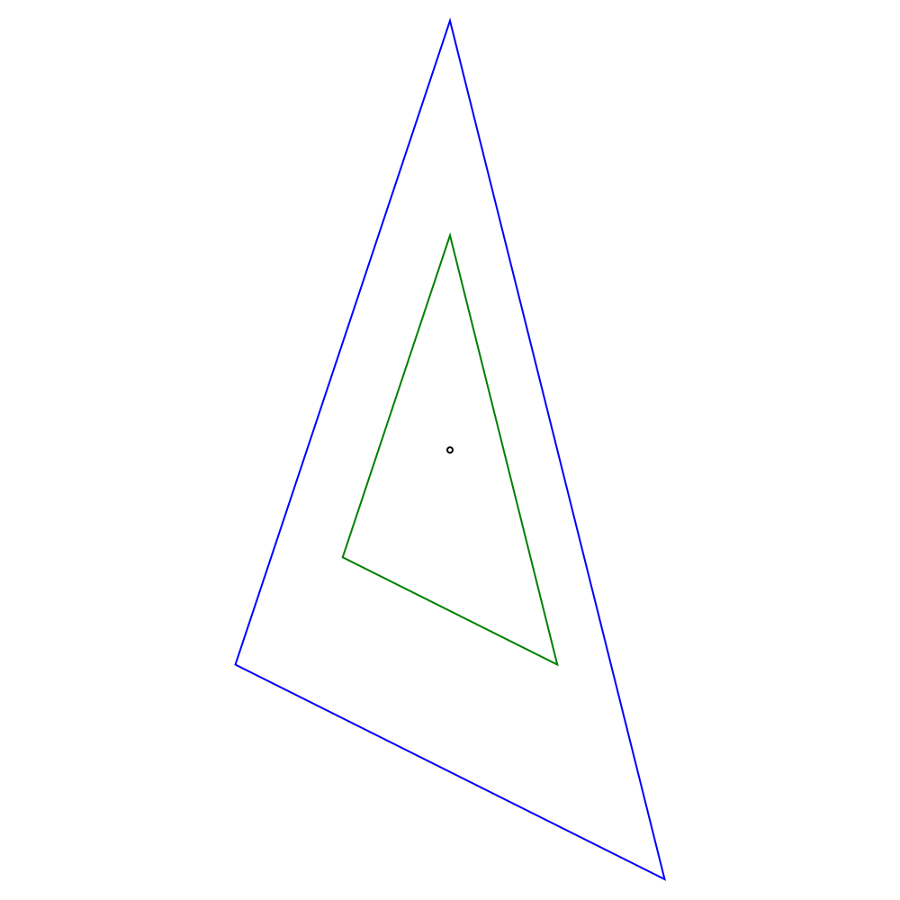
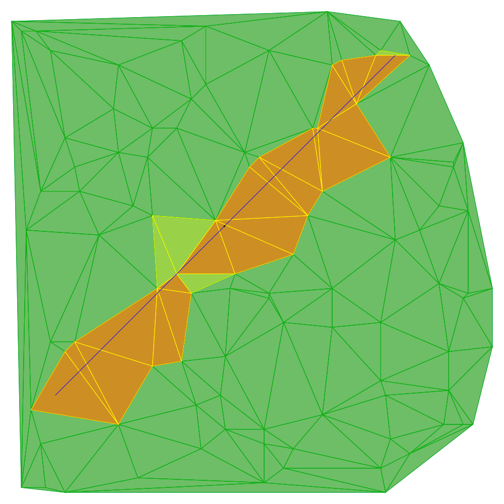

<picture>
  <source media="(prefers-color-scheme: dark)" srcset="doc/figures/logotextdark.svg"/>
  
</picture>

<!-- [](https://github.com/gfonsecabr/pgl/actions/workflows/tests.yml)
[.svg)](https://en.wikipedia.org/wiki/C%2B%2B#Standardization) -->
[.svg)](https://opensource.org/licenses/MIT)
<!-- [.svg)](https://gfonsecabr.github.io/pgl/benchmarks/index.html) -->

> ⚠️ **Work in Progress**: This library is still under construction and contains **bugs and missing features**. Use in production environments is not recommended.

Pangolin (or `pgl`) is a C++ library for computational geometry in the plane and `pypgl` is the official python binding for it. It is designed to be pleasant to use and always exact.

```python
import pypgl as pgl

p = pgl.Point(1, 0)
q = pgl.Point(4, 7)
s = pgl.Segment(p, q)
t = pgl.Segment(0, 8, 2, 1)
if s.intersects(t):
    print(s, "intersects", t)
# Output: (1,0)--(4,7) intersects (0,8)--(2,1)
```

## Shapes and Predicates

| Family | Shapes |
| --- | --- |
| 0-dimensional | [`Point`](doc/shapes.md#point) |
| 1-dimensional | [`Segment`](doc/shapes.md#segment), [`OrientedSegment`](doc/shapes.md#oriented-segment), [`Line`](doc/shapes.md#line), [`OrientedLine`](doc/shapes.md#oriented-line), [`Ray`](doc/shapes.md#ray), ~~[`Polyline`](doc/shapes.md#polyline), [`PolyFunction`](doc/shapes.md#monotone-polyline)~~ |
| 2-dimensional | [`Halfplane`](doc/shapes.md#half-plane), [`Triangle`](doc/shapes.md#triangle), [`Rectangle`](doc/shapes.md#rectangle), [`Disk`](doc/shapes.md#disk), [`Convex`](doc/shapes.md#convex), [`Polygon`](doc/shapes.md#polygon) |

The following [predicates](doc/shape_methods.md#predicates) are implemented as methods of all shapes.

- `contains(Shape)` Does it contain the other shape?
- `boundaryContains(Shape)` Does its boundary contain the other shape?
- `interiorContains(Shape)` Does it contain the other shape in the interior?
- `intersects(Shape)` Do the two shapes intersect?
- `interiorsIntersect(Shape)` Do the interiors of the two shapes intersect?
- `separates(Shape)` Does one shape cut the other into two (or more) components?
- `crosses(Shape)` Do both shapes separate each other?

```python
o = pgl.Point()      # Point (0,0)
d = pgl.Disk(o, 10)  # Disk of radius 10 centered at (0,0)
if d.contains(o):
    print("Disk contains ", o)
diam = d.diameter()
if d.contains(diam):
    print("Disk contains the diameter")
if not d.interiorContains(diam):
    print("Disk's interior does not contain the diameter")
```

## Other Methods

Several [other methods](doc/shape_methods.md) are supported by the shapes.

```python
c = pgl.Convex([pgl.Point(0, 0), pgl.Point(1, 0), pgl.Point(1, 2), pgl.Point(0, 1)])
s = c.diameter()
print("The diameter of", c,
      "is defined by", s,
      "and has length", s.length())
# Output: The diameter of Convex[(0,0),(1,0),(1,2),(0,1)] is defined by (0,0)--(1,2) and has length 2.23607
```

## Visualization

A `Canvas` class is provided for [SVG visualization](doc/canvas.md):



```python
canvas = pgl.Canvas()
canvas.add(pgl.Point(0, 0))

tri = pgl.Triangle(-1, -1, 0, 2, 1, -2)
canvas.stroke("green")
canvas.add(tri)
canvas.stroke("blue")
canvas.add(2*tri)
canvas.writeSVG("example2.svg")
```


## Algorithms and Data Structures



PGL includes [fundamental algorithms](doc/algorithms.md) and [data structures](doc/data_structures.md) such as:

- Convex hull: computed with Graham scan.
- Line segment intersection: Bentley-Ottmann sweep line using rational numbers.
- Sort points: by angle or Hilbert order.
- Kd-tree: for points and a generalization for other bounded shapes.
- Triangulation: including Delaunay and constrained Delaunay triangulations for points and polygons.


## Installation

TODO

## More Information

- For a brief description, check the documents at the [doc folder](doc/).
- For some simple examples, check the files at the [examples folder](examples/).
- Check the [C++ version](https://github.com/gfonsecabr/pgl).

