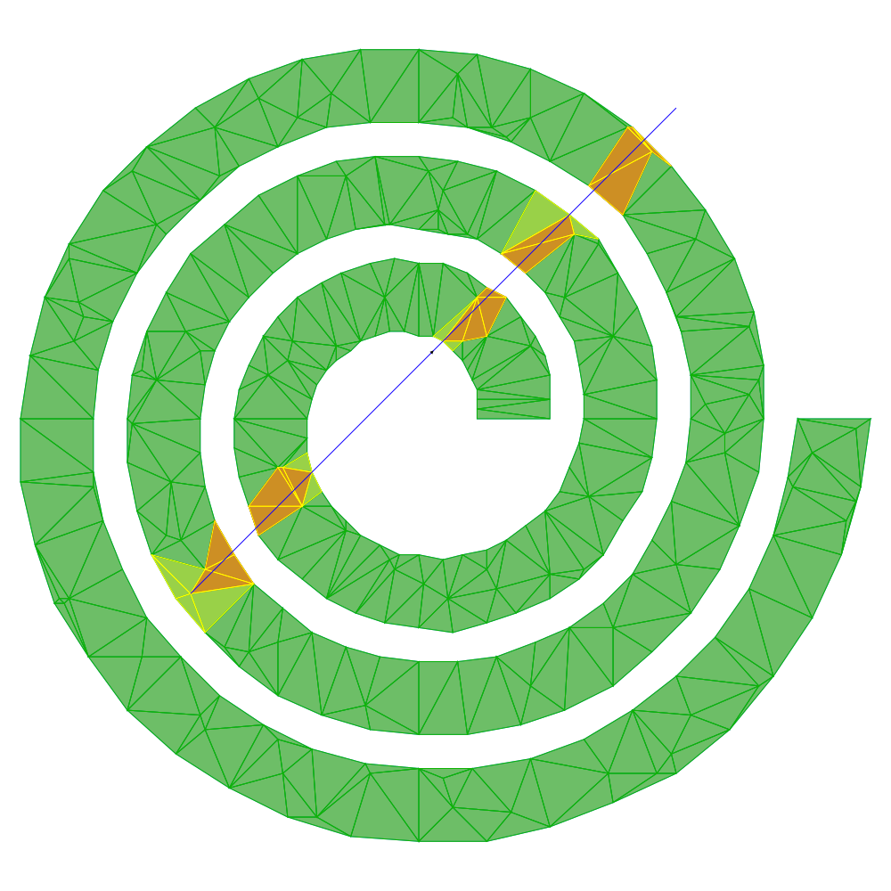

<picture>
  <source media="(prefers-color-scheme: dark)" srcset="figures/logotextdark.svg"/>
  
</picture>

[.svg)](https://en.wikipedia.org/wiki/C%2B%2B#Standardization)
[.svg)](https://opensource.org/licenses/MIT)
[.svg)](https://gfonsecabr.github.io/pgl/benchmarks/index.html)

 

> ⚠️ **Work in Progress**: This library is still under construction and contains **bugs and missing features**. Use in production environments is not recommended.

## Data Structures

### Shape Tree

`ShapeTree<Shape>` is a container for bounded shapes. The tree is built once and answers range queries against an arbitrary query shape `q`. If the tree stores $n$ points, then it is a kd-tree, with $O(\sqrt{n})$ query time for orthogonal range counting and $O(\log n)$ height. For large intersecting shapes, the tree will be similar to storing the shapes in a vector and examining all of them, but with a much larger construction time.

- `ShapeTree<Shape>(V)` builds the tree over the shapes in container `V`. An optional second argument sets the leaf size (default 8): the maximum number of shapes kept at a leaf.

The query methods come in two families. The *intersecting* family matches stored shapes `s` with `s.intersects(q)`; the *contained* family matches stored shapes `s` with `q.contains(s)`. Each family offers the same five operations:

- `countIntersecting(q)` / `countContainedIn(q)` return the number of matching stored shapes.

- `reportIntersecting(q)` / `reportContainedIn(q)` return a vector with a copy of each matching stored shape.

- `visitIntersecting(q, f)` / `visitContainedIn(q, f)` call `f(s)` on each matching stored shape `s` as it is found. If `f` returns `true` the visit stops.

- `emptyIntersecting(q)` / `emptyContainedIn(q)` return true if no stored shape matches.

- `sumIntersecting(q)` / `sumContainedIn(q)` return the sum of a weight over the matching stored shapes. The weight is given by an optional `WeightFn` template parameter mapping a shape to any type with `operator+` (`ShapeTree<Shape, WeightFn>`); the weight function is passed to the constructor and ignored by default.

- Other methods:

Sending a tree to a [Canvas](canvas.md) with `canvas << tree` draws all node bounding boxes. Is is possible to insert a new element with `insert`, but no rebalancing is performed.

  
   
  <em>A shape tree over 100 random triangles: the query triangle with the triangles it contains and intersects, plus the node bounding boxes.</em>

### Triangulation

`Triangulation` stores a mutable triangulation of either a fixed polygon or a fixed point set: the vertex coordinates are fixed at construction, only the connectivity changes. It may be constructed from a Polygon (constrained Delaunay triangulation), a container of points (Delaunay triangulation), segments, or triangles, always keeping labels. The polygon constructor optionally takes a container of extra interior points (added as vertices) and/or a container of interior segments (added as vertices and constrained edges); either may be omitted, and both are assumed to lie inside the polygon (not checked). Attention, the segments or triangles must define a valid triangulation (of the convex hull or any polygon), otherwise the behavior is undefined.

Construction and predicates are exact. For a polygon, the triangles between it and its convex hull are marked out-of-domain, so the public view — sizes, `triangles`, `edges`, `locate`, … — describes exactly the polygon, including non-convex ones. The interface speaks only in value types (`Point`, `Segment`, `Triangle`).

- `locate(p)` returns a triangle containing point `p`, or none if `p` is outside, via a randomized visibility walk.

- Navigation: `otherTriangle`, `adjacentTriangles`, `incidentTriangles`, the `visitTriangles`/`visitEdges` visitors, and the sorted `triangles()`/`edges()`.

- Range searching: `trianglesIntersecting(s)` return the triangles that satisfy `triangle.intersects(s)`. The function has several variantions `visitTrianglesIntersecting(s,f)` calls the function `f` on these triangles and stops early if `f` returns `true`. If `s` is an oriented segment, oriented line, or ray, the triangles are visited in order. The edge variations `edgesIntersecting` and `visitEdgesIntersecting` list the edges instead of the triangles. The `…InteriorIntersecting` variantions filter with `interiorIntersects(s)`.

- `flip(e)` replaces the diagonal shared by two triangles. It returns the new edge obtained or none if the flip cannot be performed (non-convex quadrilateral or the edge is constrained). `flippable(e)` simply returns if the flip can be performed without changing the triangulation. If we pass a container with edges in interior-disjoint quadrilaterals, the functions use parallel flips. `flip` is the only function that modifies the triangulation.

- Other methods:

  
   
  <em>The constrained Delaunay triangulation of a polygon with points inside. Highlighting the triangles a segment meets and those whose interior it actually intersects.</em>

