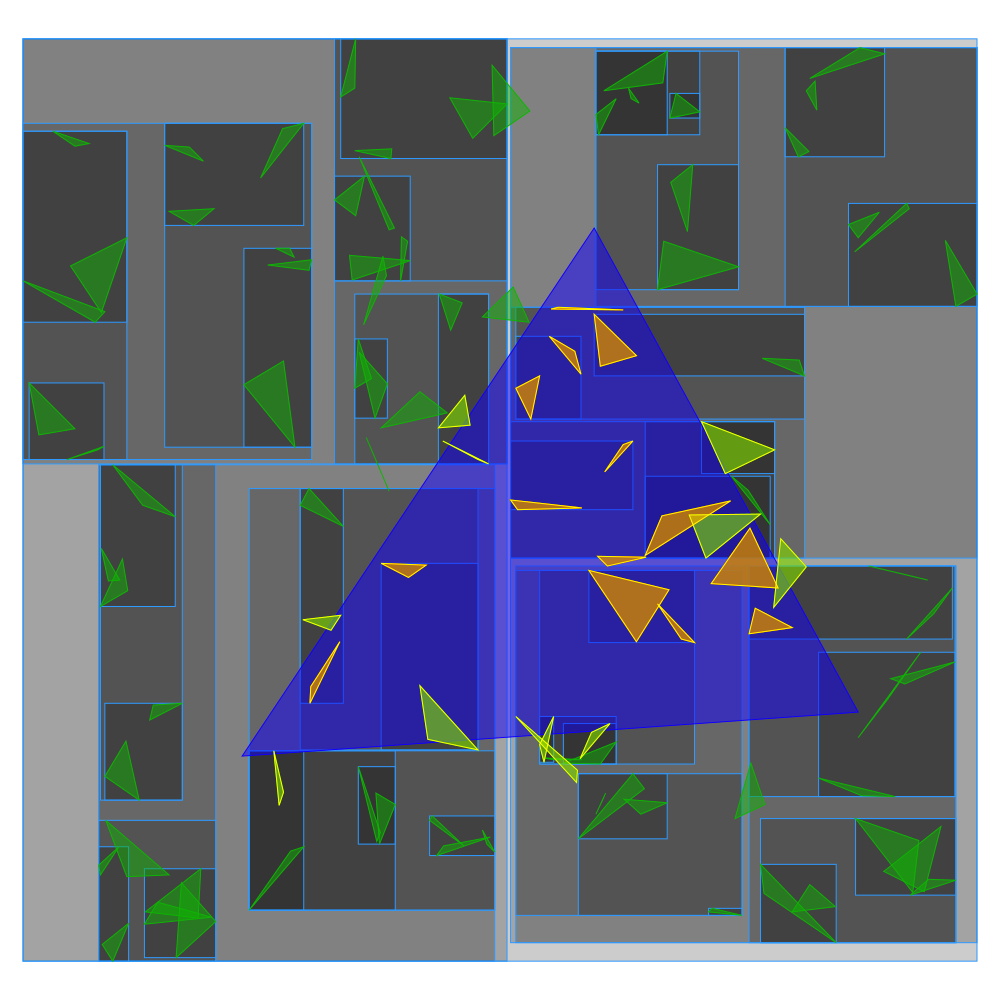

<!-- AUTO-GENERATED from doc/raw/data_structures.md by doc/raw/doxylink.py — do not edit; edit the raw version and regenerate. -->


<picture>
  <source media="(prefers-color-scheme: dark)" srcset="figures/logotextdark.svg"/>
  
</picture>

<!-- [](https://github.com/gfonsecabr/pgl/actions/workflows/tests.yml)
[.svg)](https://en.wikipedia.org/wiki/C%2B%2B#Standardization) -->
[.svg)](https://opensource.org/licenses/MIT)
<!-- [.svg)](https://gfonsecabr.github.io/pgl/benchmarks/index.html) -->

⚠️ **Work in Progress**: This library is still under construction and contains **bugs and missing features**. Use in production environments is not recommended.

## Data Structures


### Shape Tree

[`ShapeTree`](https://gfonsecabr.github.io/pgl/classpgl_1_1ShapeTree.html "Static shape tree of bounded shapes.") is a container for bounded shapes. The tree is built once and answers range queries against an arbitrary query shape. Unlike every other pypgl class, a single tree can mix shape types — a [`Triangle`](https://gfonsecabr.github.io/pgl/structpgl_1_1Triangle.html "Closed triangle stored by three vertices.") and a [`Disk`](https://gfonsecabr.github.io/pgl/structpgl_1_1Disk.html "Closed Euclidean disk stored by boundary points plus optional disk label.") can be stored side by side. If the tree stores $n$ points, then it behaves like a kd-tree, with $O(\sqrt{n})$ query time for orthogonal range counting and $O(\log n)$ height. For large intersecting shapes, the tree performs similarly to storing the shapes in a list and examining all of them, but with a much larger construction time.

- `ShapeTree(shapes, leaf_size=6)` builds the tree over [`shapes`](https://gfonsecabr.github.io/pgl/classpgl_1_1ShapeTree.html#ac99194f3238dc21544ae1e76d69295dc "Returns the stored shapes in their internal order.") (any iterable of shapes, which may mix types). `leaf_size` is the maximum number of shapes kept at a leaf before it is split.

The query methods come in two families. The *intersecting* family matches stored shapes `s` with `s.intersects(query)`; the *contained* family matches stored shapes `s` with `query.contains(s)`. Each family offers three operations:

- [`countIntersecting(query)`](https://gfonsecabr.github.io/pgl/classpgl_1_1ShapeTree.html#ab9a97f8962f28bea8a93e59c7e959014 "Counts the stored shapes intersecting a query shape.") / [`countContainedIn(query)`](https://gfonsecabr.github.io/pgl/classpgl_1_1ShapeTree.html#aae23593e5f3cee436125f3287da6b4d5 "Counts the stored shapes contained in a query shape.") return the number of matching stored shapes.

- [`reportIntersecting(query)`](https://gfonsecabr.github.io/pgl/classpgl_1_1ShapeTree.html#acfd0b343eb6267a71f22ef7f5adf6ac7 "Returns copies of the stored shapes intersecting a query shape.") / [`reportContainedIn(query)`](https://gfonsecabr.github.io/pgl/classpgl_1_1ShapeTree.html#a74aaaaabb391d4828371fdd2a74b9215 "Returns copies of the stored shapes contained in a query shape.") return a list with a copy of each matching stored shape.

- [`emptyIntersecting(query)`](https://gfonsecabr.github.io/pgl/classpgl_1_1ShapeTree.html#a8dce1815d2e4ac57b72dcc11ba22a898 "Returns whether no stored shape intersects a query shape.") / [`emptyContainedIn(query)`](https://gfonsecabr.github.io/pgl/classpgl_1_1ShapeTree.html#aa6e8876bbef51debe667a37b5086009a "Returns whether no stored shape is contained in a query shape.") return `True` if no stored shape matches.

The query shape may be any shape pypgl binds, including one that cannot itself be stored in a tree (e.g. a [`Line`](https://gfonsecabr.github.io/pgl/structpgl_1_1Line.html "Unoriented infinite line.")).

Other methods: [`size()`](https://gfonsecabr.github.io/pgl/classpgl_1_1ShapeTree.html#a3b69d00d3decdb9016cd6c78b9d8fb43 "Returns the number of stored shapes.") and [`empty()`](https://gfonsecabr.github.io/pgl/classpgl_1_1ShapeTree.html#a08029ef8e2844225621d5d6c7444532c "Returns whether the tree is empty.") report the tree's size; [`shapes()`](https://gfonsecabr.github.io/pgl/classpgl_1_1ShapeTree.html#ac99194f3238dc21544ae1e76d69295dc "Returns the stored shapes in their internal order.") returns all stored shapes, in internal order; [`has(shape)`](https://gfonsecabr.github.io/pgl/classpgl_1_1ShapeTree.html#a79f8e616b064b9319688f995c247d99d "Returns whether a shape equal to shape is stored in the tree.") reports whether a shape equal to `shape` is stored (exact membership, not a geometric test — which is why it is not called `contains`); [`insert(shape)`](https://gfonsecabr.github.io/pgl/classpgl_1_1ShapeTree.html#a0ccc82dec95517590154bd038214445d "Inserts a shape without rebalancing the existing tree.") adds a shape without rebalancing the tree (raises if `shape` cannot be stored — see below); [`erase(shape)`](https://gfonsecabr.github.io/pgl/classpgl_1_1ShapeTree.html#a448a617ddcb55d32e55a9aaec1324b90 "Removes one stored shape equal to shape.") removes one matching shape and reports whether one was found; [`rebuild(leaf_size=0)`](https://gfonsecabr.github.io/pgl/classpgl_1_1ShapeTree.html#acd07b5b5fc1b7ae74565dd8a252706cd "Rebuilds the tree from the stored shapes, restoring its quality.") restores tree quality after many [`insert`](https://gfonsecabr.github.io/pgl/classpgl_1_1ShapeTree.html#a0ccc82dec95517590154bd038214445d "Inserts a shape without rebalancing the existing tree.")/[`erase`](https://gfonsecabr.github.io/pgl/classpgl_1_1ShapeTree.html#a448a617ddcb55d32e55a9aaec1324b90 "Removes one stored shape equal to shape.") calls (`0` keeps the current leaf size); [`nearestNeighbor(query)`](https://gfonsecabr.github.io/pgl/classpgl_1_1ShapeTree.html#ab474ac9db17611ead980ea1ff63f3446 "Returns the stored shape nearest to a query shape.") returns the stored shape nearest to `query`, or `None` if the tree is empty ([`nearestNeighborL1`](https://gfonsecabr.github.io/pgl/classpgl_1_1ShapeTree.html#a39724eb61293a4a47dc06fbe529b9b10 "Returns the stored shape nearest to a query shape under the L1 (Manhattan) metric.") / [`nearestNeighborLInf`](https://gfonsecabr.github.io/pgl/classpgl_1_1ShapeTree.html#a2c6020b16ab1100e6467ca22136a80a3 "Returns the stored shape nearest to a query shape under the LInf (Chebyshev) metric.") minimize the Manhattan / Chebyshev distance instead); [`kNearestNeighbors(query, k)`](https://gfonsecabr.github.io/pgl/classpgl_1_1ShapeTree.html#a834f6a690f2d7bc186b4cd1d35cf30f8 "Returns up to k stored shapes nearest to a query shape.") returns up to `k` of them, nearest first, and has no `None` case — an empty answer is an empty list; [`boundingBoxes()`](https://gfonsecabr.github.io/pgl/classpgl_1_1ShapeTree.html#a44bafd1d3814f712f04f175897781cd2 "Returns every node's subtree bounding box in pre-order.") returns every node's bounding box, in pre-order.


A tree also behaves like a Python container: `len(tree)`, `for shape in tree`, and `shape in tree` (exact membership, same as [`has`](https://gfonsecabr.github.io/pgl/classpgl_1_1ShapeTree.html#a79f8e616b064b9319688f995c247d99d "Returns whether a shape equal to shape is stored in the tree.")).

Only bounded shapes can be stored — [`Point`](https://gfonsecabr.github.io/pgl/structpgl_1_1Point.html "Two-dimensional point with optional label payload."), [`Segment`](https://gfonsecabr.github.io/pgl/structpgl_1_1Segment.html "Unoriented closed segment between two endpoints plus optional segment label."), [`OrientedSegment`](https://gfonsecabr.github.io/pgl/structpgl_1_1OrientedSegment.html "Directed segment preserving source-to-target order plus optional segment label."), [`Triangle`](https://gfonsecabr.github.io/pgl/structpgl_1_1Triangle.html "Closed triangle stored by three vertices."), [`Rectangle`](https://gfonsecabr.github.io/pgl/structpgl_1_1Rectangle.html "Axis-aligned rectangle stored by minimum and maximum corners."), [`Convex`](https://gfonsecabr.github.io/pgl/structpgl_1_1Convex.html "Closed convex polygon stored by its vertices."), [`MonotoneChain`](https://gfonsecabr.github.io/pgl/structpgl_1_1MonotoneChain.html "Weakly x-monotone polyline stored by lexicographically sorted vertices."), [`Polyline`](https://gfonsecabr.github.io/pgl/structpgl_1_1Polyline.html "Open polygonal chain stored in traversal order; may self-intersect."), [`Polygon`](https://gfonsecabr.github.io/pgl/structpgl_1_1Polygon.html "Closed simple polygon stored by its vertices."), [`PolygonWithHoles`](https://gfonsecabr.github.io/pgl/structpgl_1_1PolygonWithHoles.html "Closed region bounded by one outer simple polygon minus disjoint polygonal holes."), [`PolygonSet`](https://gfonsecabr.github.io/pgl/structpgl_1_1PolygonSet.html "Set of closed regions with pairwise disjoint interiors."), [`Disk`](https://gfonsecabr.github.io/pgl/structpgl_1_1Disk.html "Closed Euclidean disk stored by boundary points plus optional disk label."). An unbounded shape ([`Line`](https://gfonsecabr.github.io/pgl/structpgl_1_1Line.html "Unoriented infinite line."), [`OrientedLine`](https://gfonsecabr.github.io/pgl/structpgl_1_1OrientedLine.html "Directed infinite line with left/right side semantics plus optional line label."), [`Ray`](https://gfonsecabr.github.io/pgl/structpgl_1_1Ray.html "Half-infinite line starting from one source point plus optional ray label."), [`Halfplane`](https://gfonsecabr.github.io/pgl/structpgl_1_1Halfplane.html "Closed half-plane defined by an oriented boundary line.")) raises if passed to the constructor or to [`insert`](https://gfonsecabr.github.io/pgl/classpgl_1_1ShapeTree.html#a0ccc82dec95517590154bd038214445d "Inserts a shape without rebalancing the existing tree."), but remains valid as a query shape. A [`HalfplaneIntersection`](https://gfonsecabr.github.io/pgl/structpgl_1_1HalfplaneIntersection.html "Intersection of closed half-planes; convex but possibly unbounded or empty.") is the one shape that falls on both sides: a bounded one stores like any other, an unbounded one raises, so which it is depends on the value rather than the type.

Drawing a tree with `canvas.draw(tree)` (or its inline rendering in a notebook) renders every node's bounding box.

<p align="center">
  
  <br/>
  <em>A shape tree over 100 random triangles: the query triangle with the triangles it contains and intersects, plus the node bounding boxes.</em>
</p>


### Triangulation

[`Triangulation`](https://gfonsecabr.github.io/pgl/structpgl_1_1Triangulation.html "Triangulation whose connectivity may change and whose vertex set may grow.") stores a mutable triangulation of a polygon or of a point set: the connectivity changes with every [`flip`](https://gfonsecabr.github.io/pgl/structpgl_1_1Triangulation.html#ae3a9971db0a8fa7716b554650d67921d "Flips edge s, replacing it by the opposite diagonal."), and [`insert`](https://gfonsecabr.github.io/pgl/structpgl_1_1Triangulation.html#aa8f49fe0459173b962e035688c00fc43 "Inserts p as a new vertex.") adds vertices, but a vertex is never moved.

- `Triangulation()` creates an empty triangulation.
- `Triangulation(points)` builds the Delaunay triangulation of a list of points.
- `Triangulation(points, segments)` builds the conforming constrained Delaunay triangulation of a point set with constraint segments: the vertices are the points together with the segments' endpoints, every segment appears as a constrained edge, and — unlike the polygon constructors — nothing is carved away, so the domain is the whole convex hull. The segments must be pairwise non-crossing (sharing an endpoint is fine).
- `Triangulation(triangles)` builds a triangulation from an explicit set of triangles tiling a region without overlaps.
- `Triangulation(edges)` builds a triangulation from an explicit set of edges (every bounded face must be a triangle).
- `Triangulation(polygon, points=[], segments=[])` builds the constrained Delaunay triangulation of a simple polygon (convex or not), optionally adding interior points as extra vertices and/or interior segments as constrained edges — both are assumed, not checked, to lie inside `polygon`. `polygon.triangulation()` and `polygon.triangulation(segments)` are shortcuts for this.
- `Triangulation(region, points=[], segments=[])` does the same for a [`PolygonWithHoles`](shapes.md#polygon-with-holes), with `region.triangulation()` and `region.triangulation(segments)` as the shortcuts. Every ring becomes constrained edges and the hole interiors are left out of the domain, so the in-domain triangles cover exactly the part of the region that has area — a slit, having none, carries no triangle.

Construction and predicates are exact. For a polygon, the triangles between it and its convex hull are excluded, so the public view — sizes, [`triangles()`](https://gfonsecabr.github.io/pgl/structpgl_1_1Triangulation.html#adf13f4f217147acfad64a1c60294bbe0 "Returns all triangles, sorted."), [`edges()`](https://gfonsecabr.github.io/pgl/structpgl_1_1Triangulation.html#a4d9f06c16b448a6094f121d3ff64675f "Returns all edges, sorted, each with its stored label."), [`locate`](https://gfonsecabr.github.io/pgl/structpgl_1_1Triangulation.html#a29b96c32ebb52fddc7fd10eaeee4dbd8 "Finds the triangle containing the query point by walking the mesh."), … — describes exactly the polygon, including non-convex ones.

- [`numVertices()`](https://gfonsecabr.github.io/pgl/structpgl_1_1Triangulation.html#a8f74529903bc2807ee9b3b4f7b3cb704 "Number of real vertices (excludes the ghost vertex)."), [`numTriangles()`](https://gfonsecabr.github.io/pgl/structpgl_1_1Triangulation.html#af888959051dec124c651e2037ad9b3ef "Number of triangles (excludes ghost and out-of-domain fill triangles)."), [`numEdges()`](https://gfonsecabr.github.io/pgl/structpgl_1_1Triangulation.html#a92fa1929d53d876aca62b9f4b04ce4a3 "Number of undirected edges incident to the visible triangulation."), [`empty()`](https://gfonsecabr.github.io/pgl/structpgl_1_1Triangulation.html#a7d3f30955d60e885571d998bcfcb89ee "True if the triangulation stores no in-domain triangles.") report the triangulation's size.

- [`has(triangle)`](https://gfonsecabr.github.io/pgl/structpgl_1_1Triangulation.html#a485c8ec5ba96b0e3ae38652d8a1e7478 "True if t is one of the triangles of this triangulation.") / [`has(edge)`](https://gfonsecabr.github.io/pgl/structpgl_1_1Triangulation.html#a485c8ec5ba96b0e3ae38652d8a1e7478 "True if t is one of the triangles of this triangulation.") report whether a [`Triangle`](https://gfonsecabr.github.io/pgl/structpgl_1_1Triangle.html "Closed triangle stored by three vertices.")/[`Segment`](https://gfonsecabr.github.io/pgl/structpgl_1_1Segment.html "Unoriented closed segment between two endpoints plus optional segment label.") belongs to the triangulation (exact membership, not a geometric test — which is why it is not called [`contains`](https://gfonsecabr.github.io/pgl/structpgl_1_1Triangulation.html#aaafc3c4e87cc92f987dd1b4b45b33b7c "True if the triangulated domain contains shape (A ⊇ B).")).

- [`triangles()`](https://gfonsecabr.github.io/pgl/structpgl_1_1Triangulation.html#adf13f4f217147acfad64a1c60294bbe0 "Returns all triangles, sorted.") / [`edges()`](https://gfonsecabr.github.io/pgl/structpgl_1_1Triangulation.html#a4d9f06c16b448a6094f121d3ff64675f "Returns all edges, sorted, each with its stored label.") return all triangles / edges, sorted.

- [`locate(point)`](https://gfonsecabr.github.io/pgl/structpgl_1_1Triangulation.html#a29b96c32ebb52fddc7fd10eaeee4dbd8 "Finds the triangle containing the query point by walking the mesh.") returns the triangle containing `point`, or `None` if `point` lies outside the triangulated region (or the triangulation is empty).

- Navigation: [`otherTriangle(triangle, shared)`](https://gfonsecabr.github.io/pgl/structpgl_1_1Triangulation.html#aa625a8ae9abbcedae55b710f7d14f256 "The triangle on the other side of shared from t.") returns the triangle on the other side of the shared edge, or `None` on a boundary edge; [`edgeAdjacentTriangles(triangle)`](https://gfonsecabr.github.io/pgl/structpgl_1_1Triangulation.html#a9001b8c30f9fabea449151c482a129d6 "The (up to three) triangles sharing an edge with t.") returns the (up to three) triangles sharing an edge with `triangle`; [`vertexAdjacentTriangles(triangle)`](https://gfonsecabr.github.io/pgl/structpgl_1_1Triangulation.html#a876e7243b3b3570f1d7d3727a0c2390b "The triangles sharing at least one vertex with t (excluding t).") returns the triangles sharing at least one vertex with `triangle` (excluding it); [`incidentTriangles(edge)`](https://gfonsecabr.github.io/pgl/structpgl_1_1Triangulation.html#a6a46217a54fcaf96c7bce5d3e9625eaa "The (up to two) triangles incident to edge s.") returns the (up to two) triangles incident to `edge`, and [`incidentTriangles(vertex)`](https://gfonsecabr.github.io/pgl/structpgl_1_1Triangulation.html#a6a46217a54fcaf96c7bce5d3e9625eaa "The (up to two) triangles incident to edge s.") returns every triangle around a vertex, in rotational order.

- Range searching: [`trianglesIntersecting(query)`](https://gfonsecabr.github.io/pgl/structpgl_1_1Triangulation.html#a0951e0ae30e494c3a336e99b1c214f20 "Returns the triangles met by s (a segment, (oriented) line, ray, or chain, in order, or a region query shape, in an unspecified order).") returns the triangles `t` with [`t.intersects(query)`](https://gfonsecabr.github.io/pgl/structpgl_1_1Triangle.html#a94138aece9a14e3681a7a5d02cfc623b "Tests whether this shape and the other shape intersect (A ∩ B ≠ ∅)."); [`trianglesInteriorIntersecting(query)`](https://gfonsecabr.github.io/pgl/structpgl_1_1Triangulation.html#a8602cbad7ccc5220d7579c4e00b5211b "Returns the triangles whose interior s enters.") filters with [`t.interiorsIntersect(query)`](https://gfonsecabr.github.io/pgl/structpgl_1_1Triangle.html#a603a05dcc8b220b156a90c5c15dd611c "Tests whether the interiors of the two shapes intersect ((A∖∂A) ∩ (B∖∂B) ≠ ∅).") instead. [`edgesIntersecting(query)`](https://gfonsecabr.github.io/pgl/structpgl_1_1Triangulation.html#add516a5fb9be6e490e90d04334d8a95f "Returns the triangulation edges met by s.") / [`edgesInteriorIntersecting(query)`](https://gfonsecabr.github.io/pgl/structpgl_1_1Triangulation.html#ad578c0fcdbecf0822a6673f957662840 "Returns the triangulation edges whose interior s crosses.") return matching edges instead of triangles. `query` may be a [`Segment`](https://gfonsecabr.github.io/pgl/structpgl_1_1Segment.html "Unoriented closed segment between two endpoints plus optional segment label."), [`OrientedSegment`](https://gfonsecabr.github.io/pgl/structpgl_1_1OrientedSegment.html "Directed segment preserving source-to-target order plus optional segment label."), [`Line`](https://gfonsecabr.github.io/pgl/structpgl_1_1Line.html "Unoriented infinite line."), [`OrientedLine`](https://gfonsecabr.github.io/pgl/structpgl_1_1OrientedLine.html "Directed infinite line with left/right side semantics plus optional line label."), [`Ray`](https://gfonsecabr.github.io/pgl/structpgl_1_1Ray.html "Half-infinite line starting from one source point plus optional ray label."), [`MonotoneChain`](https://gfonsecabr.github.io/pgl/structpgl_1_1MonotoneChain.html "Weakly x-monotone polyline stored by lexicographically sorted vertices."), [`Polyline`](https://gfonsecabr.github.io/pgl/structpgl_1_1Polyline.html "Open polygonal chain stored in traversal order; may self-intersect."), [`Point`](https://gfonsecabr.github.io/pgl/structpgl_1_1Point.html "Two-dimensional point with optional label payload."), [`Triangle`](https://gfonsecabr.github.io/pgl/structpgl_1_1Triangle.html "Closed triangle stored by three vertices."), [`Rectangle`](https://gfonsecabr.github.io/pgl/structpgl_1_1Rectangle.html "Axis-aligned rectangle stored by minimum and maximum corners."), [`Convex`](https://gfonsecabr.github.io/pgl/structpgl_1_1Convex.html "Closed convex polygon stored by its vertices."), [`Disk`](https://gfonsecabr.github.io/pgl/structpgl_1_1Disk.html "Closed Euclidean disk stored by boundary points plus optional disk label."), or [`Halfplane`](https://gfonsecabr.github.io/pgl/structpgl_1_1Halfplane.html "Closed half-plane defined by an oriented boundary line."). If `query` is one of the five straight shapes ([`Segment`](https://gfonsecabr.github.io/pgl/structpgl_1_1Segment.html "Unoriented closed segment between two endpoints plus optional segment label."), [`OrientedSegment`](https://gfonsecabr.github.io/pgl/structpgl_1_1OrientedSegment.html "Directed segment preserving source-to-target order plus optional segment label."), [`Line`](https://gfonsecabr.github.io/pgl/structpgl_1_1Line.html "Unoriented infinite line."), [`OrientedLine`](https://gfonsecabr.github.io/pgl/structpgl_1_1OrientedLine.html "Directed infinite line with left/right side semantics plus optional line label."), [`Ray`](https://gfonsecabr.github.io/pgl/structpgl_1_1Ray.html "Half-infinite line starting from one source point plus optional ray label.")) the result is ordered along the query, and if it is a chain ([`MonotoneChain`](https://gfonsecabr.github.io/pgl/structpgl_1_1MonotoneChain.html "Weakly x-monotone polyline stored by lexicographically sorted vertices."), [`Polyline`](https://gfonsecabr.github.io/pgl/structpgl_1_1Polyline.html "Open polygonal chain stored in traversal order; may self-intersect.")) the result is ordered edge by edge along the chain; otherwise the order is unspecified.

- [`isConstrained(edge)`](https://gfonsecabr.github.io/pgl/structpgl_1_1Triangulation.html#a44f6c40d4255445c5471cc14f411c4f9 "True if side side of t is a constrained edge.") reports whether an edge is flagged as constrained; [`setConstrained(edge, value=True)`](https://gfonsecabr.github.io/pgl/structpgl_1_1Triangulation.html#aab953710686d617c897fe61c7a7b8820 "Constrains (or unconstrains) side side of t.") sets or clears that flag.

- [`flip(edge)`](https://gfonsecabr.github.io/pgl/structpgl_1_1Triangulation.html#ae3a9971db0a8fa7716b554650d67921d "Flips edge s, replacing it by the opposite diagonal.") replaces `edge` by the opposite diagonal, returning the new edge, or `None` if the flip cannot be performed (non-convex quadrilateral or a constrained edge). [`flippable(edge)`](https://gfonsecabr.github.io/pgl/structpgl_1_1Triangulation.html#ae91e0a2cede91a1c5e9c57c86128b935 "True if edge s can be flipped (unconstrained, interior, convex quad).") reports whether the flip is possible, without performing it. Both also accept a list of edges, flipping them all at once if the whole set is simultaneously flippable (all-or-nothing), or returning `None`/`False` otherwise.

- [`insert(point)`](https://gfonsecabr.github.io/pgl/structpgl_1_1Triangulation.html#aa8f49fe0459173b962e035688c00fc43 "Inserts p as a new vertex.") adds `point` as a new vertex, subdividing the triangle or edge that contains it; a point outside the convex hull grows the hull, joining `point` to every hull edge it sees (a constrained hull edge stays constrained and becomes interior). It returns `False`, leaving the triangulation unchanged, only if `point` is already a vertex or the triangulation is empty. [`insertDelaunay(point)`](https://gfonsecabr.github.io/pgl/structpgl_1_1Triangulation.html#a68f9c3c737c4d6dbeb79b0d9c54e2b86 "Inserts p as a new vertex and restores the constrained Delaunay property around it.") does the same and then restores the constrained Delaunay property around the new vertex by Lawson flips (never flipping a constrained edge), so a triangulation that was constrained Delaunay stays constrained Delaunay.

  For a triangulation built from a polygon, `point` **must lie in the closed polygon** — exactly like the constructor's extra points. Inserting one outside it (in the region carved away between the polygon and its hull, or beyond the hull) is undefined behavior, and it is *not* checked: a bad point silently corrupts the mesh rather than raising.

[`flip`](https://gfonsecabr.github.io/pgl/structpgl_1_1Triangulation.html#ae3a9971db0a8fa7716b554650d67921d "Flips edge s, replacing it by the opposite diagonal."), [`insert`](https://gfonsecabr.github.io/pgl/structpgl_1_1Triangulation.html#aa8f49fe0459173b962e035688c00fc43 "Inserts p as a new vertex."), [`insertDelaunay`](https://gfonsecabr.github.io/pgl/structpgl_1_1Triangulation.html#a68f9c3c737c4d6dbeb79b0d9c54e2b86 "Inserts p as a new vertex and restores the constrained Delaunay property around it.") and [`setConstrained`](https://gfonsecabr.github.io/pgl/structpgl_1_1Triangulation.html#aab953710686d617c897fe61c7a7b8820 "Constrains (or unconstrains) side side of t.") are the only methods that mutate the triangulation; the vertex coordinates themselves are fixed at construction, except that [`insert`](https://gfonsecabr.github.io/pgl/structpgl_1_1Triangulation.html#aa8f49fe0459173b962e035688c00fc43 "Inserts p as a new vertex.")/[`insertDelaunay`](https://gfonsecabr.github.io/pgl/structpgl_1_1Triangulation.html#a68f9c3c737c4d6dbeb79b0d9c54e2b86 "Inserts p as a new vertex and restores the constrained Delaunay property around it.") add new ones.

- Predicates against the **domain** — the region the triangulation covers, which is the polygon for the polygon constructors and the convex hull otherwise. [`contains(shape)`](https://gfonsecabr.github.io/pgl/structpgl_1_1Triangulation.html#aaafc3c4e87cc92f987dd1b4b45b33b7c "True if the triangulated domain contains shape (A ⊇ B)."), [`interiorContains(shape)`](https://gfonsecabr.github.io/pgl/structpgl_1_1Triangulation.html#ac8f4f9837036712a981d607662c46a7e "True if the domain's interior contains shape (A∖∂A ⊇ B)."), [`intersects(shape)`](https://gfonsecabr.github.io/pgl/structpgl_1_1Triangulation.html#a44a3da24570a922992d8a639cf284c05 "True if the triangulated domain meets shape (A ∩ B ≠ ∅).") and [`interiorsIntersect(shape)`](https://gfonsecabr.github.io/pgl/structpgl_1_1Triangulation.html#aa1ed2d5434f154fcba49c68efa8856d5 "True if the domain's interior meets shape's interior (A∖∂A ∩ B∖∂B ≠ ∅).") give exactly the answers the shape predicates of the same name give for that region as a [`Polygon`](https://gfonsecabr.github.io/pgl/structpgl_1_1Polygon.html "Closed simple polygon stored by its vertices."), boundary and all: a segment running along a boundary edge is contained and met, but neither interior-contained nor interior-intersecting. They work on the mesh, so the cost follows the triangles the query meets rather than the size of the boundary. They ask a different question from [`has()`](https://gfonsecabr.github.io/pgl/structpgl_1_1Triangulation.html#a485c8ec5ba96b0e3ae38652d8a1e7478 "True if t is one of the triangles of this triangulation."), which is about being a *cell* of the mesh.

- [`asGraph()`](https://gfonsecabr.github.io/pgl/structpgl_1_1Triangulation.html#a65444fde473c8410c150f5df6af1bc08 "Returns the mesh's vertices and edges as a Graph.") returns the 1-skeleton as a [`Graph`](#graph): its vertices are the `numVertices()` stored points and its edges the `numEdges()` edges of the visible mesh. A point identifies a vertex here, so the graph is keyed by the points themselves. A vertex with no in-domain edge comes back isolated; the ghost vertex closing the mesh at infinity is internal and is not one of them.

- [`voronoiDiagram()`](https://gfonsecabr.github.io/pgl/structpgl_1_1Triangulation.html#afb6e1ee72b6120aecb34db17618b6b73 "Returns the Voronoi diagram dual to this Delaunay triangulation.") returns the unbounded [`Arrangement`](#arrangement) dual to the triangulation, which must be non-empty and Delaunay. Each face is labelled with the point that generated its Voronoi cell, so `diagram.label(diagram.locateFace(q))` is the site nearest to `q`. At a Voronoi edge or vertex `locateFace` picks one tied site by its infinitesimal-perturbation rule; `locateCell` plus the incident faces recovers all of them. Exact: the vertices are rationals.

- [`convexPartition()`](https://gfonsecabr.github.io/pgl/structpgl_1_1Triangulation.html#aafbc40eb662b7f172fa337331dd75422 "The domain cut into convex pieces with pairwise disjoint interiors.") cuts the domain into [`Convex`](shapes.md#convex) pieces with pairwise disjoint interiors, each the union of one or more triangles, within a factor of four of the fewest possible. A constrained edge is never deleted, so the constraints shape the partition. `convexCovering()` instead grows one candidate per triangle and greedily selects and thins them, so the pieces may overlap. `Polygon` and `PolygonWithHoles` have both as shorthands.

- Visibility: [`visibilityGraph()`](https://gfonsecabr.github.io/pgl/structpgl_1_1Triangulation.html#a141876bf80db34393696b8cae8495ca0 "Returns the visibility graph of the mesh vertices."), [`clearVisibilityGraph()`](https://gfonsecabr.github.io/pgl/structpgl_1_1Triangulation.html#adbd74d1387b607a884e10efae49a37d1 "Returns the clear visibility graph of the mesh vertices."), [`reducedVisibilityGraph()`](https://gfonsecabr.github.io/pgl/structpgl_1_1Triangulation.html#a071b3ab30404b2e1a117f6bbb5b2959b "Returns the reduced visibility graph of the mesh vertices."), [`visibleVertices(q)`](https://gfonsecabr.github.io/pgl/structpgl_1_1Triangulation.html#a3ec93b7700354398247e96c0ee9ba4db "The mesh vertices visible from query."), [`clearlyVisibleVertices(q)`](https://gfonsecabr.github.io/pgl/structpgl_1_1Triangulation.html#acf558d9f546dc683eb1df21f1c5a77f4 "The mesh vertices clearly visible from query.") and [`regularizedVisiblePolygon(q)`](https://gfonsecabr.github.io/pgl/structpgl_1_1Triangulation.html#a289c57eec01a32a56c8858240ef93cf3 "The region of the domain visible from query, regularized."), all described under [Visibility](algorithms.md#visibility). Sight is stopped by the boundary of the domain *and by every constrained edge*, which is what makes `polygon.triangulation(walls).visibilityGraph()` visibility inside `polygon` among the obstacles `walls`.

- [`checkInvariants()`](https://gfonsecabr.github.io/pgl/structpgl_1_1Triangulation.html#a3f9750066fb8ff41030cdb1a54c02903 "Checks the structural invariants (orientation + neighbor symmetry). Intended for debug assertions.") checks the structural invariants (orientation and neighbor symmetry); intended for debugging.

- Other methods: [`convexCovering`](https://gfonsecabr.github.io/pgl/structpgl_1_1Triangulation.html#a4c5d9617e71751a0019af9490fd76c4b "Covers the domain with a greedily selected set of convex polygons.").

Drawing a triangulation with `canvas.draw(triangulation)` (or its inline rendering in a notebook) renders every triangle.

<p align="center">
  
  <br/>
  <em>The constrained Delaunay triangulation of a polygon with points inside. Highlighting the triangles a segment meets and those whose interior it actually intersects.</em>
</p>


### Interval Tree

[`IntervalTree`](https://gfonsecabr.github.io/pgl/classpgl_1_1IntervalTree.html "Mutable interval tree over the projection of bounded shapes.") is a **mutable** one-dimensional index over bounded shapes. It
stores, for each shape, the closed interval its bounding box projects to on one
axis, and keeps the shapes themselves, so a query can go back to exact
two-dimensional geometry once the projection has pruned the candidates.

- `IntervalTree(shapes)` builds a tree over any iterable of bounded shapes, which
  may mix types; `IntervalTree()` starts empty. `IntervalTreeY` is the same class
  projecting on the y axis instead of on x.
- [`insert(shape)`](https://gfonsecabr.github.io/pgl/classpgl_1_1IntervalTree.html#a2f8d70f5f499a90566d2bf2d3bc4bf54 "Inserts shape and its selected closed bounding-box interval.") and [`erase(shape)`](https://gfonsecabr.github.io/pgl/classpgl_1_1IntervalTree.html#a5232163e9152216e4602bfee044b5940 "Removes one stored shape equal to shape.") add and remove one shape while keeping the
  tree balanced, so unlike a [`ShapeTree`](#shape-tree) it stays efficient after
  heavy mutation. Equal projected intervals are stored independently.

The queries come in two families, and they answer different questions.

The **projection** family decides from the intervals alone, never looking at the
shapes: [`countProjectionsIntersecting(query)`](https://gfonsecabr.github.io/pgl/classpgl_1_1IntervalTree.html#a3e9f0fb15e803efb81b60a27bee3dadc "Counts shapes whose projected interval intersects the projection of q."),
[`reportProjectionsIntersecting(query)`](https://gfonsecabr.github.io/pgl/classpgl_1_1IntervalTree.html#ae15ed226417c72c9acc097047b1e69eb "Returns copies of shapes whose projected interval intersects that of q."), [`emptyProjectionsIntersecting(query)`](https://gfonsecabr.github.io/pgl/classpgl_1_1IntervalTree.html#a4efb73d10446f444b0accf4097530670 "Returns whether no stored projected interval intersects the projection of q."),
and the three `…ProjectionsContainedIn` counterparts. Touching at an endpoint
counts as meeting, and containment includes shared endpoints. Two shapes whose
x-ranges overlap may be nowhere near each other in the plane, so this is a
coarser question rather than a faster answer to the exact one.

The **exact** family prunes by the projection and then applies the
two-dimensional predicate: [`countIntersecting(query)`](https://gfonsecabr.github.io/pgl/classpgl_1_1IntervalTree.html#a156229167292264d17c76144bb222538 "Counts stored shapes that geometrically intersect q."),
[`reportIntersecting(query)`](https://gfonsecabr.github.io/pgl/classpgl_1_1IntervalTree.html#ab45e85ab0acaf3990602f9795873cf12 "Returns copies of stored shapes that geometrically intersect q."), [`emptyIntersecting(query)`](https://gfonsecabr.github.io/pgl/classpgl_1_1IntervalTree.html#a8cd86feabd58f266e7339d8028c92b00 "Returns whether no stored shape geometrically intersects q.") and the three
`…ContainedIn` counterparts return exactly what a [`ShapeTree`](https://gfonsecabr.github.io/pgl/classpgl_1_1ShapeTree.html "Static shape tree of bounded shapes.") returns over the
same stored shapes.

Every query is projected before anything else happens, so — unlike a
[`ShapeTree`](https://gfonsecabr.github.io/pgl/classpgl_1_1ShapeTree.html "Static shape tree of bounded shapes."), which prunes the query against stored boxes — an unbounded shape is
rejected as a *query* as well as as an element.

Other methods: [`size()`](https://gfonsecabr.github.io/pgl/classpgl_1_1IntervalTree.html#ac55a6eeebf7559e1f64933a9a9f45aae "Returns the number of stored shapes."), [`empty()`](https://gfonsecabr.github.io/pgl/classpgl_1_1IntervalTree.html#ad88be49dab6c9f09d0d58e40a02df8a0 "Returns whether no shape is stored."), [`shapes()`](https://gfonsecabr.github.io/pgl/classpgl_1_1IntervalTree.html#a4cb6798a11ec9ab0a74ef855e4d60c42 "Returns the stored shapes in internal storage order."), [`has(shape)`](https://gfonsecabr.github.io/pgl/classpgl_1_1IntervalTree.html#ac311ca8d07c24b2f8edc96676aa72dfd "Returns whether a shape equal to shape is stored."), and the container
sugar `len(tree)`, `for shape in tree`, `shape in tree`.

- Other methods: [`countContainedIn`](https://gfonsecabr.github.io/pgl/classpgl_1_1IntervalTree.html#ae918a604763091e59b3c6652a4a3fc56 "Counts stored shapes geometrically contained in q."), [`countProjectionsContainedIn`](https://gfonsecabr.github.io/pgl/classpgl_1_1IntervalTree.html#ae7512c04c575239858fc93b464ccab27 "Counts shapes whose projected interval is contained in the projection of q."), [`emptyContainedIn`](https://gfonsecabr.github.io/pgl/classpgl_1_1IntervalTree.html#a5a39cac11c397647ef15094ac54c4c70 "Returns whether no stored shape is geometrically contained in q."), [`emptyProjectionsContainedIn`](https://gfonsecabr.github.io/pgl/classpgl_1_1IntervalTree.html#adc67523854627f68ef2c8c992943198e "Returns whether no stored projected interval is contained in that of q."), [`reportContainedIn`](https://gfonsecabr.github.io/pgl/classpgl_1_1IntervalTree.html#a139270ac2f3309e47b4015db43d3c30f "Returns copies of stored shapes geometrically contained in q."), [`reportProjectionsContainedIn`](https://gfonsecabr.github.io/pgl/classpgl_1_1IntervalTree.html#adf6864ce62642b2afab0aa927ab18f6d "Returns copies of shapes whose projected interval is contained in that of q.").


### Arrangement

[`Arrangement`](https://gfonsecabr.github.io/pgl/classpgl_1_1Arrangement.html "The planar subdivision induced by a set of one-dimensional shapes.") is the subdivision of the plane induced by segments, rays and
lines. Its finite **vertices** are finite input endpoints, isolated input points,
crossings and the ends of overlaps; its **edges** are the atomic pieces between
them; and its **faces** are the connected components of the complement. Every
finite point of the plane belongs to exactly one cell.

Construction is exact and there is nothing to configure: two segments with
integer endpoints generally cross at a *rational* point, and coordinates here are
exact rationals, so every crossing is representable.

```python
a = pgl.Arrangement([pgl.Segment(0,0, 4,4), pgl.Segment(0,4, 4,0)])
a.vertexCount(), a.edgeCount(), a.faceCount()
# Output: (5, 4, 1)
```

- `Arrangement(shapes)` builds the arrangement of any iterable of shapes: points, segments and oriented segments, polylines and monotone chains, the boundaries of triangles, rectangles, convexes, polygons and regions, and lines, oriented lines and rays. The input may cross, overlap collinearly, repeat, share endpoints, or dangle with a free end; overlapping stretches are merged into one edge that remembers every shape covering it.
- `Arrangement(shapes, points)` additionally makes every given point a vertex wherever it falls: a point on a shape splits it there, and a point on nothing becomes a vertex incident to no edge, in the interior of the face holding it.

The structure is a doubly connected edge list, and the face of a halfedge is
always the one on its **left**, so a bounded face is enclosed by a
counterclockwise cycle and the outer boundary of a connected piece of the input
runs clockwise. All unbounded ends meet at one symbolic vertex at infinity,
ordered by their exact escape direction; there is no clipping frame, and every
halfedge really is part of some input shape.

Cells are named by three handle types — `VertexId`, `HalfedgeId` and `FaceId` —
which are distinct classes rather than plain integers, so a face handle cannot be
passed where a vertex handle is meant. Each has `index()` and `valid()`, and a
default-constructed one is the invalid handle.

- [`vertexCount()`](https://gfonsecabr.github.io/pgl/classpgl_1_1Arrangement.html#a9bfe5b4cb80249fc1de127b50d919188 "Returns the number of finite vertices."), [`edgeCount()`](https://gfonsecabr.github.io/pgl/classpgl_1_1Arrangement.html#a08f11793b25ddd2fb556024f743c0b5d "Returns the number of edges, i.e. half the number of halfedges."), [`halfedgeCount()`](https://gfonsecabr.github.io/pgl/classpgl_1_1Arrangement.html#a6be0d6fc0290903229de2381a0d21e94 "Returns the number of halfedges: always even, twins being adjacent."), [`faceCount()`](https://gfonsecabr.github.io/pgl/classpgl_1_1Arrangement.html#a51d90b5e5695c1ca8a8d8b6c661ff33c "Returns the number of faces, including every unbounded face."): the numbers of finite vertices, geometric edges, halfedges and faces, every unbounded face included. Face 0 is unbounded, though a line or a pair of rays can create several unbounded faces. The vertex at infinity is not counted, and its handle index is exactly [`vertexCount()`](https://gfonsecabr.github.io/pgl/classpgl_1_1Arrangement.html#a9bfe5b4cb80249fc1de127b50d919188 "Returns the number of finite vertices.").
- [`vertices()`](https://gfonsecabr.github.io/pgl/classpgl_1_1Arrangement.html#a2bb65a8786775e6483bcf31c977d19d9 "Returns the position of every finite vertex, in VertexId index order.") returns the finite vertices' positions, [`edges()`](https://gfonsecabr.github.io/pgl/classpgl_1_1Arrangement.html#a658e5933985b5519b6ff1bffe872182d "Returns every edge as a segment, line, or ray.") one [`Segment`](https://gfonsecabr.github.io/pgl/structpgl_1_1Segment.html "Unoriented closed segment between two endpoints plus optional segment label."), [`Line`](https://gfonsecabr.github.io/pgl/structpgl_1_1Line.html "Unoriented infinite line.") or [`Ray`](https://gfonsecabr.github.io/pgl/structpgl_1_1Ray.html "Half-infinite line starting from one source point plus optional ray label.") per edge, and [`boundedEdges()`](https://gfonsecabr.github.io/pgl/classpgl_1_1Arrangement.html#a16442f32a0a800dde923998ad4a14b47 "Returns the bounded edges, omitting every ray and line.") only the segments.
- `position(v)` is a finite vertex's position — it raises for the vertex at infinity — and `halfedge(h)` is a halfedge's geometry, directed along it: an [`OrientedSegment`](https://gfonsecabr.github.io/pgl/structpgl_1_1OrientedSegment.html "Directed segment preserving source-to-target order plus optional segment label."), an [`OrientedLine`](https://gfonsecabr.github.io/pgl/structpgl_1_1OrientedLine.html "Directed infinite line with left/right side semantics plus optional line label.") or a [`Ray`](https://gfonsecabr.github.io/pgl/structpgl_1_1Ray.html "Half-infinite line starting from one source point plus optional ray label.").
- [`witness(v)`](https://gfonsecabr.github.io/pgl/classpgl_1_1Arrangement.html#af441a5410fccd05e29db0b5cc47bfe6f "Returns the vertex itself, as the witness of a zero-dimensional cell.") / [`witness(h)`](https://gfonsecabr.github.io/pgl/classpgl_1_1Arrangement.html#af441a5410fccd05e29db0b5cc47bfe6f "Returns the vertex itself, as the witness of a zero-dimensional cell.") / [`witness(f)`](https://gfonsecabr.github.io/pgl/classpgl_1_1Arrangement.html#af441a5410fccd05e29db0b5cc47bfe6f "Returns the vertex itself, as the witness of a zero-dimensional cell.") return a point of a cell: the vertex itself, a point inside an edge, and a point strictly inside a bounded face.
- Topology: [`twin(h)`](https://gfonsecabr.github.io/pgl/classpgl_1_1Arrangement.html#ae9cbf6c800e81f9844448c4955605400 "Returns the halfedge running along the same edge the other way."), [`next(h)`](https://gfonsecabr.github.io/pgl/classpgl_1_1Arrangement.html#ad26b2743252be523aaa112695da9229f "Returns the next halfedge along the boundary of the face on the left."), [`source(h)`](https://gfonsecabr.github.io/pgl/classpgl_1_1Arrangement.html#a3e855a4641eb8f76ce19e455ec4f7d4f "Returns the vertex a halfedge leaves."), [`target(h)`](https://gfonsecabr.github.io/pgl/classpgl_1_1Arrangement.html#aac4567b70d33c495d2e73e7411826415 "Returns the vertex a halfedge arrives at."), [`face(h)`](https://gfonsecabr.github.io/pgl/classpgl_1_1Arrangement.html#ab0f9eb9a9380adc8e30e4d511c1d808b "Returns the face to the left of a halfedge."), [`outgoing(v)`](https://gfonsecabr.github.io/pgl/classpgl_1_1Arrangement.html#abc89a3616eccf001896fd74946214090 "Returns one halfedge leaving a vertex, or the invalid handle when the vertex is isolated."), [`outgoingHalfedges(v)`](https://gfonsecabr.github.io/pgl/classpgl_1_1Arrangement.html#ad388b90580685275b4259621a226c5f9 "Returns every halfedge leaving a vertex, in clockwise order.") (clockwise around a vertex, and accepting the infinity handle), and [`degree(v)`](https://gfonsecabr.github.io/pgl/classpgl_1_1Arrangement.html#abbf8bb0c7267ae2824a31bd6d4a8b8e5 "Returns the number of halfedges leaving a vertex.") — one halfedge per incident edge end, so a vertex where $k$ lines cross has degree $2k$.
- [`isUnbounded()`](https://gfonsecabr.github.io/pgl/classpgl_1_1Arrangement.html#a4c561c065cadb4d7b36ef2c1b2fbe4f8 "Tells whether the arrangement contains an unbounded edge.") reports whether the arrangement has any unbounded edge; [`isUnbounded(h)`](https://gfonsecabr.github.io/pgl/classpgl_1_1Arrangement.html#a4c561c065cadb4d7b36ef2c1b2fbe4f8 "Tells whether the arrangement contains an unbounded edge.") and [`isUnbounded(f)`](https://gfonsecabr.github.io/pgl/classpgl_1_1Arrangement.html#a4c561c065cadb4d7b36ef2c1b2fbe4f8 "Tells whether the arrangement contains an unbounded edge.") ask about one edge or face, and [`isFictitious(v)`](https://gfonsecabr.github.io/pgl/classpgl_1_1Arrangement.html#a5f478284cef3adb80cf2d2352f41619e "Tells whether a vertex is the symbolic point at infinity.") identifies the vertex at infinity.
- Faces: [`outerCycle(f)`](https://gfonsecabr.github.io/pgl/classpgl_1_1Arrangement.html#a05069bcdb1916a1d21ba617d892285d9 "Returns a halfedge of the face's outer boundary cycle, which runs counterclockwise, or the invalid handle for an unbounded face."), [`innerCycles(f)`](https://gfonsecabr.github.io/pgl/classpgl_1_1Arrangement.html#a074077c8678609fe02321d7865457327 "Returns one halfedge of each of the face's inner boundary cycles, each of which runs clockwise."), [`outerBoundaryOf(f)`](https://gfonsecabr.github.io/pgl/classpgl_1_1Arrangement.html#af8902ab9cdd64b29cb4ea514c780a0e9 "Returns the halfedges of a face's counterclockwise outer boundary."), [`innerBoundariesOf(f)`](https://gfonsecabr.github.io/pgl/classpgl_1_1Arrangement.html#a6ce69c84e03c1a730b8e85e4a4fe4f60 "Returns the halfedges of every clockwise inner boundary cycle."), [`boundaryOf(f)`](https://gfonsecabr.github.io/pgl/classpgl_1_1Arrangement.html#ab6759442f288fc2db8514dddd87b59c3 "Returns every halfedge bounding a face, outer cycle first.") and [`hasSimpleBoundary(f)`](https://gfonsecabr.github.io/pgl/classpgl_1_1Arrangement.html#a3224e1107d50043c33d7f6728b9dc979 "Tells whether a face's boundary is a single simple ring: no hole, and no edge with the face on both sides.").
- [`polygonWithHoles(f)`](https://gfonsecabr.github.io/pgl/classpgl_1_1Arrangement.html#a205ae05e50d60caab291b28fc602c743 "Returns the closure of a bounded face as a region.") returns the closure of a bounded face as a [`PolygonWithHoles`](shapes.md#polygon-with-holes), regularized: a dangling edge sticking into the face is dropped, and a cycle pinching shut at a vertex is cut there into one ring per side. It raises for an unbounded face.
- [`halfplaneIntersection(f)`](https://gfonsecabr.github.io/pgl/classpgl_1_1Arrangement.html#aac2785cf3263014e41da06c326372616 "Returns the outer boundary constraints of a face as a half-plane intersection, ignoring holes.") returns the intersection of the supporting half-planes of the face's outer boundary, for a bounded or an unbounded face alike. It equals the face with its holes filled when that boundary is convex.
- [`label(cell)`](https://gfonsecabr.github.io/pgl/classpgl_1_1Arrangement.html#a59a9ea3992f564c1797a1569afc1f17d "Returns the label an edge inherited from the input shape that produced it.") and `setLabel(cell, value)` read and write a [`Point`](https://gfonsecabr.github.io/pgl/structpgl_1_1Point.html "Two-dimensional point with optional label payload.") label per edge or per face — what to use to record a classification per cell. [`originsOf(h)`](https://gfonsecabr.github.io/pgl/classpgl_1_1Arrangement.html#a9297bbde7dbcd2b664e579112efb837b "Returns the positions, in the range the arrangement was built from, of every input shape that produced an edge.") and [`originsOf(v)`](https://gfonsecabr.github.io/pgl/classpgl_1_1Arrangement.html#a9297bbde7dbcd2b664e579112efb837b "Returns the positions, in the range the arrangement was built from, of every input shape that produced an edge.") list the positions, in the input list, of every shape that produced a cell.
- Point location: [`locateFace(point)`](https://gfonsecabr.github.io/pgl/classpgl_1_1Arrangement.html#a95d36d4248271458151cc640bf838704 "Returns the face containing a point.") returns the face containing a point (for a point on an edge or a vertex, the face an infinitesimal displacement lands in), and [`locateCell(point)`](https://gfonsecabr.github.io/pgl/classpgl_1_1Arrangement.html#a20a88708be61b0431bf65e3b944b824a "Returns the vertex, edge, or face containing a point.") returns the cell that actually contains it, as a `VertexId`, a `HalfedgeId` or a `FaceId` — tell them apart with `isinstance`. [`buildPointLocation()`](https://gfonsecabr.github.io/pgl/classpgl_1_1Arrangement.html#af73b4d7888dfb82faaabaf0156b208a5 "Builds the randomized trapezoidal point-location index.") builds an exact trapezoidal map and search DAG, after which queries take expected logarithmic time instead of scanning the edges; [`hasPointLocation()`](https://gfonsecabr.github.io/pgl/classpgl_1_1Arrangement.html#a0ffabaaa3d0a89074ae83a6b3a6f8321 "Tells whether locateFace currently uses the point-location index.") and [`clearPointLocation()`](https://gfonsecabr.github.io/pgl/classpgl_1_1Arrangement.html#a7a17361bda2910fe462e306176dfc73f "Releases this arrangement's reference to its point-location index.") complete the trio.
- Tracing a directed curve: [`reportIntersecting(curve)`](https://gfonsecabr.github.io/pgl/classpgl_1_1Arrangement.html#a1b4345f0c7e1facd1376e8a7c127b4c3 "Returns every vertex and edge met by a directed curve, in order.") returns the cells the curve meets, in order along it, [`firstIntersecting(curve)`](https://gfonsecabr.github.io/pgl/classpgl_1_1Arrangement.html#a5862ce4aad1add7a6c1c3a40f664406b "Returns the first vertex or edge met by a directed curve.") only the first, and [`emptyIntersecting(curve)`](https://gfonsecabr.github.io/pgl/classpgl_1_1Arrangement.html#a202256304a61715926954c0eb9e0d03c "Returns whether a directed curve meets no vertex or edge.") whether it meets none. The curve may be an [`OrientedSegment`](https://gfonsecabr.github.io/pgl/structpgl_1_1OrientedSegment.html "Directed segment preserving source-to-target order plus optional segment label."), [`OrientedLine`](https://gfonsecabr.github.io/pgl/structpgl_1_1OrientedLine.html "Directed infinite line with left/right side semantics plus optional line label."), [`Ray`](https://gfonsecabr.github.io/pgl/structpgl_1_1Ray.html "Half-infinite line starting from one source point plus optional ray label."), [`MonotoneChain`](https://gfonsecabr.github.io/pgl/structpgl_1_1MonotoneChain.html "Weakly x-monotone polyline stored by lexicographically sorted vertices.") or [`Polyline`](https://gfonsecabr.github.io/pgl/structpgl_1_1Polyline.html "Open polygonal chain stored in traversal order; may self-intersect."). Where the curve meets an edge only at one of its endpoints, the vertex there stands for the contact.
- [`asGraph()`](https://gfonsecabr.github.io/pgl/classpgl_1_1Arrangement.html#a5c299514a909c3d750f9faff91d3e196 "Returns the vertex-edge incidence structure as a Graph.") returns the vertex-edge incidence structure as an `ArrangementGraph`, a [`Graph`](#graph) over vertex handles rather than points — the vertex at infinity has no position, so it could not be keyed by one.

A [Voronoi diagram](#triangulation) is an [`Arrangement`](https://gfonsecabr.github.io/pgl/classpgl_1_1Arrangement.html "The planar subdivision induced by a set of one-dimensional shapes.") whose faces carry their
generating site as a label, so the two share this whole interface.

- Other methods: `halfedge`, `position`, `setLabel`.


### Graph

[`Graph`](https://gfonsecabr.github.io/pgl/classpgl_1_1Graph.html "Undirected simple graph stored as adjacency sets.") is an undirected simple graph over points, the combinatorial companion of
the geometric structures: it is what the [visibility](algorithms.md#visibility)
methods return, and what `Triangulation.asGraph()` hands back.

- `Graph()` builds an empty graph, `Graph(edges)` one from a list of `(u, v)` endpoint pairs. [`addVertex(v)`](https://gfonsecabr.github.io/pgl/classpgl_1_1Graph.html#a24ad00aef263704a6de29e91790b002c "Adds a vertex if it is not already present.") adds an isolated vertex and [`addEdge(u, v)`](https://gfonsecabr.github.io/pgl/classpgl_1_1Graph.html#ad16a529b19566b14e7f8c39ad15352c7 "Adds an undirected edge and its endpoints.") adds an edge along with any endpoint still missing; [`removeEdge(u, v)`](https://gfonsecabr.github.io/pgl/classpgl_1_1Graph.html#ad995dddec014774cc4ab4d3350190c23 "Removes an undirected edge if it is present.") leaves the endpoints in place, [`removeVertex(v)`](https://gfonsecabr.github.io/pgl/classpgl_1_1Graph.html#a01dd69e09bf6d97010dc4b821fba0e68 "Removes a vertex and every incident edge.") deletes every incident edge with the vertex, and [`clear()`](https://gfonsecabr.github.io/pgl/classpgl_1_1Graph.html#ab3e3b01b7a1ce196c1cc6dbf9ab59c55 "Removes every vertex and edge.") empties the graph. A self-loop is ignored.
- [`containsVertex(v)`](https://gfonsecabr.github.io/pgl/classpgl_1_1Graph.html#a13af1a574d1154a8b648d267220bbd36 "Tests whether a vertex is present."), [`containsEdge(u, v)`](https://gfonsecabr.github.io/pgl/classpgl_1_1Graph.html#ad761712593286f9ec5dcb24ebc8d601a "Tests whether an undirected edge is present."), [`vertexCount()`](https://gfonsecabr.github.io/pgl/classpgl_1_1Graph.html#a30d9b1889a6c6dbc67e2327a41c7772a "Returns the number of vertices."), [`edgeCount()`](https://gfonsecabr.github.io/pgl/classpgl_1_1Graph.html#ac91e80daafc93037fc43615c3b8cc97f "Returns the number of undirected edges."), [`maxDegree()`](https://gfonsecabr.github.io/pgl/classpgl_1_1Graph.html#afba58d8033ea13a134d53b4b5ef58c86 "Returns the largest vertex degree."), and [`degree(v)`](https://gfonsecabr.github.io/pgl/classpgl_1_1Graph.html#aa0e56dc340b090366e972cfd1b984511 "Returns the degree of a vertex.") — which returns `None` for an absent vertex.
- [`vertices()`](https://gfonsecabr.github.io/pgl/classpgl_1_1Graph.html#af171cf5f5b0b5a021afbffa7d3ffedaa "Returns a lazy view over the vertices."), [`edges()`](https://gfonsecabr.github.io/pgl/classpgl_1_1Graph.html#ad05e39af26a52b0665de5125409ae9be "Returns a lazy view over the undirected edges."), [`neighbors(v)`](https://gfonsecabr.github.io/pgl/classpgl_1_1Graph.html#ab7d1d5987dba69f7c1ab020a6507f645 "Returns the neighbors of a vertex.") and [`closedNeighbors(v)`](https://gfonsecabr.github.io/pgl/classpgl_1_1Graph.html#ac7b11522a0d8be5669b71c3167430ab5 "Returns a vertex together with all of its neighbors.") return **sorted** lists, so a program's output never depends on hashing. [`edges()`](https://gfonsecabr.github.io/pgl/classpgl_1_1Graph.html#ad05e39af26a52b0665de5125409ae9be "Returns a lazy view over the undirected edges.") gives each undirected edge once, as a `(u, v)` pair in increasing order. Asking about an absent vertex raises.
- [`bfs(v)`](https://gfonsecabr.github.io/pgl/classpgl_1_1Graph.html#a96aca939c3e4cc060cb72088a66326da "Traverses a connected component in breadth-first order.") returns the connected component of `v` in breadth-first order and [`bfs(v, k)`](https://gfonsecabr.github.io/pgl/classpgl_1_1Graph.html#a96aca939c3e4cc060cb72088a66326da "Traverses a connected component in breadth-first order.") stops after `k` vertices; [`components()`](https://gfonsecabr.github.io/pgl/classpgl_1_1Graph.html#a59f105712a9dbeda92cc0703c4a17fa3 "Returns the graph's connected components.") returns the connected components, largest first.
- [`biconnectedComponents()`](https://gfonsecabr.github.io/pgl/classpgl_1_1Graph.html#a7d824006e09e9f7780cfc28d38922a71 "Returns the vertex-biconnected blocks of the graph.") returns the vertex sets of the vertex-biconnected blocks, largest first: a bridge is a two-vertex block, an articulation vertex belongs to more than one, and an isolated vertex to none.
- [`cliqueCover()`](https://gfonsecabr.github.io/pgl/classpgl_1_1Graph.html#aa78575482ac3111a487f986b26eb27ba "Computes a vertex clique cover using the DSATUR heuristic.") partitions the vertices into cliques, largest first, by DSATUR coloring of the complement graph. The number of cliques is not guaranteed minimum.
- [`spanningTree(weight)`](https://gfonsecabr.github.io/pgl/classpgl_1_1Graph.html#a6502db7f7bf67c808b5108926d5c5e1c "Computes a minimum spanning forest using Prim's algorithm.") returns a minimum spanning tree as another graph, by Prim's algorithm in $O(m \log m)$. `weight(u, v)` may return any comparable number — `Fraction` to stay exact, `float` for Euclidean lengths — and must be symmetric. A disconnected graph gives one tree per component, so the result always has the same vertices and components.
- [`shortestPath(source, target, weight)`](https://gfonsecabr.github.io/pgl/classpgl_1_1Graph.html#ab58eb2a3ec3b553dbecb29228beed1c5 "Computes a shortest path between two vertices using Dijkstra's algorithm.") returns the vertices of a shortest path, both ends included, by Dijkstra's algorithm. Weights must be non-negative and add up with `+`, neither of which is checked. A vertex to itself is that vertex alone, and an empty result means there is no path — different components, or an absent endpoint.
- [`shortestPath(source, target, weight, lowerBound)`](https://gfonsecabr.github.io/pgl/classpgl_1_1Graph.html#ab58eb2a3ec3b553dbecb29228beed1c5 "Computes a shortest path between two vertices using Dijkstra's algorithm.") finds the same path by A* instead: `lowerBound(v, target)` estimates what is left to travel and prioritizes the vertices that look closest, which expands far fewer of them than Dijkstra when the estimate is informative. It must be non-negative, must never exceed the true remaining distance and must be zero at the target — none of which is checked, and an overestimate simply returns a path that need not be shortest. It need not be consistent: a vertex is reopened whenever a shorter route to it turns up. Straight-line distance is the usual choice when the weights are Euclidean lengths.

```python
square = pgl.Polygon([0,0, 4,0, 4,4, 0,4])
graph = square.visibilityGraph()
tree = graph.spanningTree(lambda a, b: a.squaredDistance(b))   # exact weights
print(tree.edgeCount())
# Output: 3
```

A graph also behaves like a Python container: `len(graph)`, `for vertex in
graph` (sorted), and `vertex in graph`. It is mutable and therefore unhashable.

