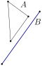
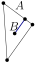

<picture>
  <source media="(prefers-color-scheme: dark)" srcset="figures/logotextdark.svg"/>
  
</picture>

<!-- [](https://github.com/gfonsecabr/pgl/actions/workflows/tests.yml)
[.svg)](https://en.wikipedia.org/wiki/C%2B%2B#Standardization) -->
[.svg)](https://opensource.org/licenses/MIT)
<!-- [.svg)](https://gfonsecabr.github.io/pgl/benchmarks/index.html) -->


> ⚠️ **Work in Progress**: This library is still under construction and contains **bugs and missing features**. Use in production environments is not recommended.

## Methods Common to Most Shapes

### Predicates

Any two shapes `A`,`B` support the following [predicates](#predicates), where $\partial A$ denotes the manifold boundary of $A$. Notice that the boundary of a one-dimensional shape is defined as its endpoints (see also [shapes](shapes.md)).

| Predicate | Definition | Question |
| --------- | ---------- | --------- |
| `A.contains(B)` | $A \supseteq B$ | Does `A` contain `B`? |
| `A.boundaryContains(B)` | $\partial A \supseteq B$ | Does the boundary of `A` contain `B`? |
| `A.interiorContains(B)` | $(A \setminus \partial A) \supseteq B$ | Does the interior of `A` contain `B`? |
| `A.intersects(B)` | $A \cap B \neq \emptyset$ | Do `A` and `B` intersect? |
| `A.interiorsIntersect(B)` | $(A \setminus \partial A) \cap (B \setminus \partial B) \neq \emptyset$ | Do the interiors of `A` and `B` intersect? |
| `A.separates(B)` | $B \setminus A$ disconnected | Does the removal of `A` separate `B`? |
| `A.crosses(B)` | $A \setminus B$ and $B \setminus A$ disconnected | Does the removal of each of `A` and `B` separate the other? |

The following table illustrates the result of the predicates for a triangle and a line segment.

| Predicate |  |  |  |  |  |  |  |  |
| --- | --- | --- | --- | --- | --- | --- | --- | --- |
| `A.contains(B)`           | ❌ | ❌ | ❌ | ❌ | ❌ | ✅ | ✅ | ✅ |
| `B.contains(A)`           | ❌ | ❌ | ❌ | ❌ | ❌ | ❌ | ❌ | ❌ |
| `A.boundaryContains(B)`   | ❌ | ❌ | ❌ | ❌ | ❌ | ❌ | ❌ | ✅ |
| `B.boundaryContains(A)`   | ❌ | ❌ | ❌ | ❌ | ❌ | ❌ | ❌ | ❌ |
| `A.interiorContains(B)`   | ❌ | ❌ | ❌ | ❌ | ❌ | ❌ | ✅ | ❌ |
| `B.interiorContains(A)`   | ❌ | ❌ | ❌ | ❌ | ❌ | ❌ | ❌ | ❌ |
| `A.intersects(B)`         | ❌ | ✅ | ✅ | ✅ | ✅ | ✅ | ✅ | ✅ |
| `A.interiorsIntersect(B)` | ❌ | ❌ | ✅ | ✅ | ✅ | ✅ | ✅ | ❌ |
| `A.separates(B)`          | ❌ | ❌ | ✅ | ❌ | ❌ | ❌ | ❌ | ❌ |
| `B.separates(A)`          | ❌ | ❌ | ✅ | ✅ | ❌ | ❌ | ❌ | ❌ |
| `A.crosses(B)`            | ❌ | ❌ | ✅ | ❌ | ❌ | ❌ | ❌ | ❌ |

All predicates are computed exactly. Coordinates in `pypgl` are arbitrary-precision
rationals (`fractions.Fraction`), so there are no overflow or rounding concerns.


### Operators

Shapes are translated by adding or subtracting a point. The point coordinates
are added to, or subtracted from, every defining point of the shape.

```python
p = pgl.Point(2, 3)
q = pgl.Point(4, 5)
s = pgl.Segment(p, q)   #  s = (2,3)--(4,5)
t1 = p + s              # t1 = (4,6)--(6,8)
t2 = s - p              # t2 = (0,0)--(2,2)
```

In-place translations use `+=` and `-=`.
Scaling around the origin uses the operator `*` or `*=` with a scalar.

```python
s = pgl.Segment(2, 3, 4, 5)   #  s = (2,3)--(4,5)
s += pgl.Point(1, 2)          #  s = (3,5)--(5,7)
s *= 10                       #  s = (30,50)--(50,70)
```

If we want to scale around a particular point `p`, we can use a combination of the previous operators:

```python
s = pgl.Segment(2, 3, 4, 5)   # s = (2,3)--(4,5)
p = s.midpoint()              # p = (3,4)
t = 3 * (s - p) + p           # t = (0,1)--(6,7)
```

### Intersection

The intersection of two shapes is returned directly as a Python object. The
result is `None` when the shapes do not meet, and otherwise the concrete shape
of the intersection — which may depend on the two operands (the intersection of
two segments, for example, may be a `Point` or a `Segment`). There are no
sentinels or wrappers: you test for `None` and otherwise use the object directly.

```python
s = pgl.Segment(0, 0, 5, 5)
t = pgl.Segment(0, 3, 5, 3)
isec = s.intersection(t)
# isec is a pgl.Point here; it would be None if the shapes did not meet
if isec is not None:
    print(isec)   # (3,3)
```

Overlapping collinear segments instead yield a `Segment`, so branch on the
returned type with `isinstance`:

```python
a = pgl.Segment(0, 0, 4, 0)
b = pgl.Segment(2, 0, 6, 0)
isec = a.intersection(b)
if isinstance(isec, pgl.Point):
    ...           # touching at a single point
elif isinstance(isec, pgl.Segment):
    print(isec)   # (2,0)--(4,0)
```

> `intersection` is currently bound for pairs whose result is a point or a 1D
> shape. Intersections that can produce a 2D region (two 2D shapes, or anything
> against a `Halfplane`) are not bound yet; see [the roadmap](../ROADMAP.md).

### Other Methods for Shapes

- `rotated90(k=1)`: Returns the shape rotated by `90k` degrees around the
  origin.

- `rotate90(k=1)`: Rotates the shape by `90k` degrees around the origin.

- `scaledUpX(Number)`: Returns the shape with the x-coordinate multiplied by a
  number.

- `scaleUpX(Number)`: Multiplies the x-coordinate by a number.

- `scaledUpY(Number)`: Returns the shape with the y-coordinate multiplied by a
  number.

- `scaleUpY(Number)`: Multiplies the y-coordinate by a number.

- `scaledDownX(Number)`: Returns the shape with the x-coordinate divided by a
  number.

- `scaleDownX(Number)`: Divides the x-coordinate by a number.

- `scaledDownY(Number)`: Returns the shape with the y-coordinate divided by a
  number.

- `scaleDownY(Number)`: Divides the y-coordinate by a number.

- `squaredDistance(Shape)`: Returns the exact squared Euclidean distance as a
  `Fraction`. Because `pypgl` is exact throughout, the result is always exact —
  there is no result-type parameter and no truncation. The squared distance,
  rather than the distance itself, is exposed because the distance is generally
  irrational; `Point.distance` is available when an approximate `float` is
  wanted.

- `squaredHausdorffDistance(Shape)`: Returns the exact squared Hausdorff distance
  as a `Fraction`.

- `bbox()`: Returns the minimum axis-aligned bounding box as a `Rectangle`.
  Defined for the bounded shapes (`Point`, `Segment`, `OrientedSegment`,
  `Triangle`, `Rectangle`, `Convex`); the unbounded shapes (`Line`,
  `OrientedLine`, `Ray`, `Halfplane`) have no bounding box.

- `area()`: Returns the area.

- `twiceArea()`: Returns two times the area.

- `diameter()`: Returns a segment that defines the diameter.

- `pointInside()`: Returns a point strictly in the interior of the shape. Uses
  only division by a power of 2.

- `verticesContain(p)`: Returns `True` if there exists an index `i` such that `s[i] == p` for the shape `s`. Notice that two shapes (for example lines) may be equal (according to `==`) but still behave differently for `verticesContain` if they are defined by different points.

## Iterating

Shapes with a fixed or enumerable vertex set (`Segment`, `OrientedSegment`,
`Triangle`, `Rectangle`, `Convex`) are directly iterable over their vertices:

```python
tri = pgl.Triangle(0, 0, 4, 0, 0, 3)
for v in tri:          # iterate vertices
    print(v)
list(tri)              # [(0,0), (4,0), (0,3)]
```

The accessors below each return a generator, so wrap them in `list(...)` to
materialize the elements:

- `vertices()`: Yields the `Point` vertices.

- `edges()`: Yields the edges as `Segment`.

- `orientedEdges()`: Yields the edges as `OrientedSegment` in counterclockwise
  order.

### Indexed access

Iterable shapes support standard Python indexing over their defining points:

- `len(s)`: Returns the number of indexable elements.

- `s[i]`: Returns the `i`-th element. Negative indices count from the end, as
  usual in Python and large indices are taken modulo the length.

- `s.index(p)`: Returns the smallest index `i` such that `s[i] == p`, or `None` if no such index exists.

```python
c = pgl.Convex([pgl.Point(0, 0), pgl.Point(4, 0), pgl.Point(4, 3), pgl.Point(0, 3)])
c[2]                      # (4,3)
c[-1]                     # (0,3), same as c[3]
c.index(pgl.Point(4, 3))  # 2, since c[2] == (4,3)
```


