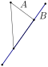
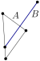
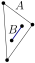

<!-- AUTO-GENERATED from doc/raw/shape_methods.md by doc/raw/doxylink.py — do not edit; edit the raw version and regenerate. -->


<picture>
  <source media="(prefers-color-scheme: dark)" srcset="figures/logotextdark.svg"/>
  
</picture>

<!-- [](https://github.com/gfonsecabr/pgl/actions/workflows/tests.yml)
[.svg)](https://en.wikipedia.org/wiki/C%2B%2B#Standardization) -->
[.svg)](https://opensource.org/licenses/MIT)
<!-- [.svg)](https://gfonsecabr.github.io/pgl/benchmarks/index.html) -->

## Methods Common to Most Shapes

### Predicates

Any two shapes `A`,`B` support the following [predicates](#predicates), where $\partial A$ denotes the manifold boundary of $A$. Notice that the boundary of a one-dimensional shape is defined as its endpoints, and is empty for a closed [`Polyline`](https://gfonsecabr.github.io/pgl/structpgl_1_1Polyline.html "Open polygonal chain stored in traversal order; may self-intersect.") (see also [shapes](shapes.md)).

| Predicate | Definition | Question |
| --------- | ---------- | --------- |
| `A.contains(B)` | $A \supseteq B$ | Does `A` contain `B`? |
| `A.boundaryContains(B)` | $\partial A \supseteq B$ | Does the boundary of `A` contain `B`? |
| `A.interiorContains(B)` | $(A \setminus \partial A) \supseteq B$ | Does the interior of `A` contain `B`? |
| `A.intersects(B)` | $A \cap B \neq \emptyset$ | Do `A` and `B` intersect? |
| `A.interiorsIntersect(B)` | $(A \setminus \partial A) \cap (B \setminus \partial B) \neq \emptyset$ | Do the interiors of `A` and `B` intersect? |
| `A.separates(B)` | $B \setminus A$ disconnected | Does the removal of `A` separate `B`? |
| `A.crosses(B)` | $A \setminus B$ and $B \setminus A$ disconnected | Does the removal of each of `A` and `B` separate the other? |

The following table illustrates the result of the predicates for a triangle and a line segment.

| Predicate |  |  |  |  |  |  |  |  |
| --- | --- | --- | --- | --- | --- | --- | --- | --- |
| `A.contains(B)`           | ❌ | ❌ | ❌ | ❌ | ❌ | ✅ | ✅ | ✅ |
| `B.contains(A)`           | ❌ | ❌ | ❌ | ❌ | ❌ | ❌ | ❌ | ❌ |
| `A.boundaryContains(B)`   | ❌ | ❌ | ❌ | ❌ | ❌ | ❌ | ❌ | ✅ |
| `B.boundaryContains(A)`   | ❌ | ❌ | ❌ | ❌ | ❌ | ❌ | ❌ | ❌ |
| `A.interiorContains(B)`   | ❌ | ❌ | ❌ | ❌ | ❌ | ❌ | ✅ | ❌ |
| `B.interiorContains(A)`   | ❌ | ❌ | ❌ | ❌ | ❌ | ❌ | ❌ | ❌ |
| `A.intersects(B)`         | ❌ | ✅ | ✅ | ✅ | ✅ | ✅ | ✅ | ✅ |
| `A.interiorsIntersect(B)` | ❌ | ❌ | ✅ | ✅ | ✅ | ✅ | ✅ | ❌ |
| `A.separates(B)`          | ❌ | ❌ | ✅ | ❌ | ❌ | ❌ | ❌ | ❌ |
| `B.separates(A)`          | ❌ | ❌ | ✅ | ✅ | ❌ | ❌ | ❌ | ❌ |
| `A.crosses(B)`            | ❌ | ❌ | ✅ | ❌ | ❌ | ❌ | ❌ | ❌ |

One predicate sits outside that uniform surface. `A.interiorContainsInterior(s)`
asks whether the *open* segment `s` lies in the interior of `A`: everything
strictly between the endpoints must be strictly inside, while either endpoint may
rest on the boundary. `interiorContains` cannot express that — it refuses a
segment whose endpoints touch $\partial A$ — and a sightline between two boundary
vertices is exactly that shape, which is why the predicate exists. It is defined
on [`Polygon`](shapes.md#polygon), [`PolygonWithHoles`](shapes.md#polygon-with-holes)
and [`PolygonSet`](shapes.md#polygon-set), and takes a `Segment`.

All predicates are computed exactly. Coordinates in `pypgl` are arbitrary-precision
rationals (`fractions.Fraction`), so there are no overflow or rounding concerns.


### Operators

Shapes are translated by adding or subtracting a point. The point coordinates
are added to, or subtracted from, every defining point of the shape.

```python
p = pgl.Point(2, 3)
q = pgl.Point(4, 5)
s = pgl.Segment(p, q)   #  s = (2,3)--(4,5)
t1 = p + s              # t1 = (4,6)--(6,8)
t2 = s - p              # t2 = (0,0)--(2,2)
```

Adding a *point* is the special case of adding two shapes, which is their
[Minkowski sum](#minkowski-sum).

Scaling around the origin uses `*` (or `/`) with a scalar, and `+=`/`-=`/`*=`/`/=`
work as expected:

```python
s = pgl.Segment(2, 3, 4, 5)   #  s = (2,3)--(4,5)
s += pgl.Point(1, 2)          #  s = (3,5)--(5,7)
s *= 10                       #  s = (30,50)--(50,70)
```

If we want to scale around a particular point `p`, we can use a combination of the previous operators:

```python
s = pgl.Segment(2, 3, 4, 5)   # s = (2,3)--(4,5)
p = s.midpoint()              # p = (3,4)
t = 3 * (s - p) + p           # t = (0,1)--(6,7)
```

**Mutability.** The fixed-size shapes ([`Point`](https://gfonsecabr.github.io/pgl/structpgl_1_1Point.html "Two-dimensional point with optional label payload."), [`Segment`](https://gfonsecabr.github.io/pgl/structpgl_1_1Segment.html "Unoriented closed segment between two endpoints plus optional segment label."), [`OrientedSegment`](https://gfonsecabr.github.io/pgl/structpgl_1_1OrientedSegment.html "Directed segment preserving source-to-target order plus optional segment label."),
[`Line`](https://gfonsecabr.github.io/pgl/structpgl_1_1Line.html "Unoriented infinite line."), [`OrientedLine`](https://gfonsecabr.github.io/pgl/structpgl_1_1OrientedLine.html "Directed infinite line with left/right side semantics plus optional line label."), [`Ray`](https://gfonsecabr.github.io/pgl/structpgl_1_1Ray.html "Half-infinite line starting from one source point plus optional ray label."), [`Halfplane`](https://gfonsecabr.github.io/pgl/structpgl_1_1Halfplane.html "Closed half-plane defined by an oriented boundary line."), [`Triangle`](https://gfonsecabr.github.io/pgl/structpgl_1_1Triangle.html "Closed triangle stored by three vertices."), [`Rectangle`](https://gfonsecabr.github.io/pgl/structpgl_1_1Rectangle.html "Axis-aligned rectangle stored by minimum and maximum corners."), [`Disk`](https://gfonsecabr.github.io/pgl/structpgl_1_1Disk.html "Closed Euclidean disk stored by boundary points plus optional disk label.")) are
immutable and hashable, like `tuple` or `fractions.Fraction`: every operator
returns a *new* shape, so `s += p` rebinds `s` and leaves any earlier copy — for
instance one used as a `dict` key — untouched. The variable-size shapes
([`Convex`](https://gfonsecabr.github.io/pgl/structpgl_1_1Convex.html "Closed convex polygon stored by its vertices."), [`Polygon`](https://gfonsecabr.github.io/pgl/structpgl_1_1Polygon.html "Closed simple polygon stored by its vertices."), [`MonotoneChain`](https://gfonsecabr.github.io/pgl/structpgl_1_1MonotoneChain.html "Weakly x-monotone polyline stored by lexicographically sorted vertices."), [`Polyline`](https://gfonsecabr.github.io/pgl/structpgl_1_1Polyline.html "Open polygonal chain stored in traversal order; may self-intersect."), [`PolygonWithHoles`](https://gfonsecabr.github.io/pgl/structpgl_1_1PolygonWithHoles.html "Closed region bounded by one outer simple polygon minus disjoint polygonal holes."),
[`HalfplaneIntersection`](https://gfonsecabr.github.io/pgl/structpgl_1_1HalfplaneIntersection.html "Intersection of closed half-planes; convex but possibly unbounded or empty.")) are instead **mutable**: each
keeps a lazy translation offset, so `c += p` translates in O(1) regardless of the
vertex count. Because they are mutable they are **unhashable** (they cannot be a
`dict` key or `set` member), exactly as Python's own `list`/`set` are — this is
what prevents a shape from being silently corrupted while stored in a container.
`c + p` still returns a new shape (an O(n) copy) when you want one.

### Transformations

[`Transformation`](https://gfonsecabr.github.io/pgl/structpgl_1_1Transformation.html "Affine transformation stored as a 2x3 matrix.") is a general affine map of the plane — a 2x2 linear part plus a
translation, stored as a 2x3 matrix. The same `*` operator applies it to a shape
and composes it with another transformation, always with the transformation on
the left, so `t1 * t2 * shape` composes and applies left to right, with the
right-hand transformation applied first:

```python
s = pgl.Segment(0, 0, 5, 5)
t = pgl.Transformation.rotation90(1) * pgl.Transformation.translation(2, 0)
print(t * s)   # (-5,7)--(0,2): translated first, then rotated
```

The factories cover the exact cases: `identity()`, `translation(dx, dy)`,
`scaling(sx, sy)` (or `scaling(s)` for a uniform one), `rotation90(k=1)`,
`shearX(k)`, `shearY(k)`, `reflectionX()`, `reflectionY()`. A transformation can
also be built from its six matrix entries directly,
`Transformation(a, b, c, d, tx=0, ty=0)`, mapping `(x, y)` to
`(a*x + b*y + tx, c*x + d*y + ty)`, and read back through `a()`, `b()`, `c()`,
`d()`, `tx()`, `ty()`. An arbitrary-angle rotation is deliberately **not**
bound: it is irrational for a general angle, and `pypgl` is exact throughout.

`determinant()` is negative exactly when the transformation reverses orientation
(a reflection, or an odd number of shears and reflections composed together).
Shapes with a winding or normalization invariant ([`Triangle`](https://gfonsecabr.github.io/pgl/structpgl_1_1Triangle.html "Closed triangle stored by three vertices."), [`Convex`](https://gfonsecabr.github.io/pgl/structpgl_1_1Convex.html "Closed convex polygon stored by its vertices."),
[`MonotoneChain`](https://gfonsecabr.github.io/pgl/structpgl_1_1MonotoneChain.html "Weakly x-monotone polyline stored by lexicographically sorted vertices."), [`Polygon`](https://gfonsecabr.github.io/pgl/structpgl_1_1Polygon.html "Closed simple polygon stored by its vertices.")) renormalize themselves, and [`Halfplane`](https://gfonsecabr.github.io/pgl/structpgl_1_1Halfplane.html "Closed half-plane defined by an oriented boundary line.") swaps its
source and target to keep the same interior, so the result of `t * shape` is
always a well-formed shape of the same class.

`isInvertible()` reports whether the determinant is nonzero, and `inverse()`
returns the inverse transformation — raising `ValueError` on a singular one
rather than dividing by zero. Coordinates are exact rationals, so the inverse is
exact too.

Applying a transformation to a [`Rectangle`](https://gfonsecabr.github.io/pgl/structpgl_1_1Rectangle.html "Axis-aligned rectangle stored by minimum and maximum corners.") or a [`Disk`](https://gfonsecabr.github.io/pgl/structpgl_1_1Disk.html "Closed Euclidean disk stored by boundary points plus optional disk label.") raises `TypeError`: a
general affine map turns a rectangle into a parallelogram and a disk into an
ellipse, and neither class can represent that. Every other shape is accepted.

### Intersection

The intersection of two shapes is returned directly as a Python object. The
result is `None` when the shapes do not meet, and otherwise the concrete shape
of the intersection — which may depend on the two operands (the intersection of
two segments, for example, may be a [`Point`](https://gfonsecabr.github.io/pgl/structpgl_1_1Point.html "Two-dimensional point with optional label payload.") or a [`Segment`](https://gfonsecabr.github.io/pgl/structpgl_1_1Segment.html "Unoriented closed segment between two endpoints plus optional segment label.")). There are no
sentinels or wrappers: you test for `None` and otherwise use the object directly.

```python
s = pgl.Segment(0, 0, 5, 5)
t = pgl.Segment(0, 3, 5, 3)
isec = s.intersection(t)
# isec is a pgl.Point here; it would be None if the shapes did not meet
if isec is not None:
    print(isec)   # (3,3)
```

Overlapping collinear segments instead yield a [`Segment`](https://gfonsecabr.github.io/pgl/structpgl_1_1Segment.html "Unoriented closed segment between two endpoints plus optional segment label."), so branch on the
returned type with `isinstance`:

```python
a = pgl.Segment(0, 0, 4, 0)
b = pgl.Segment(2, 0, 6, 0)
isec = a.intersection(b)
if isinstance(isec, pgl.Point):
    ...           # touching at a single point
elif isinstance(isec, pgl.Segment):
    print(isec)   # (2,0)--(4,0)
```

A chain ([`Polyline`](https://gfonsecabr.github.io/pgl/structpgl_1_1Polyline.html "Open polygonal chain stored in traversal order; may self-intersect."), [`MonotoneChain`](https://gfonsecabr.github.io/pgl/structpgl_1_1MonotoneChain.html "Weakly x-monotone polyline stored by lexicographically sorted vertices.")) can meet even a straight shape in
arbitrarily many disjoint places, so `chain.intersection(s)` returns a *list* of
[`Point`](https://gfonsecabr.github.io/pgl/structpgl_1_1Point.html "Two-dimensional point with optional label payload.") and [`Segment`](https://gfonsecabr.github.io/pgl/structpgl_1_1Segment.html "Unoriented closed segment between two endpoints plus optional segment label.") pieces instead of a single object; a [`Polygon`](https://gfonsecabr.github.io/pgl/structpgl_1_1Polygon.html "Closed simple polygon stored by its vertices.") likewise
returns a list, of the [`Point`](https://gfonsecabr.github.io/pgl/structpgl_1_1Point.html "Two-dimensional point with optional label payload.") pieces of a 1D intersection. A [`PolygonSet`](https://gfonsecabr.github.io/pgl/structpgl_1_1PolygonSet.html "Set of closed regions with pairwise disjoint interiors.")
returns a list for the same reason twice over — its own components are apart,
so even a segment can cross it in several places.

[`PolygonWithHoles`](https://gfonsecabr.github.io/pgl/structpgl_1_1PolygonWithHoles.html "Closed region bounded by one outer simple polygon minus disjoint polygonal holes.") carries a second `intersection` alongside this one, returning
regions rather than components, because it is the one shape whose intersections
can have holes. See [Boolean Operations](#boolean-operations).

A [`HalfplaneIntersection`](https://gfonsecabr.github.io/pgl/structpgl_1_1HalfplaneIntersection.html "Intersection of closed half-planes; convex but possibly unbounded or empty.") intersected with another convex region
([`Halfplane`](https://gfonsecabr.github.io/pgl/structpgl_1_1Halfplane.html "Closed half-plane defined by an oriented boundary line."), [`Rectangle`](https://gfonsecabr.github.io/pgl/structpgl_1_1Rectangle.html "Axis-aligned rectangle stored by minimum and maximum corners."), [`Triangle`](https://gfonsecabr.github.io/pgl/structpgl_1_1Triangle.html "Closed triangle stored by three vertices."), [`Convex`](https://gfonsecabr.github.io/pgl/structpgl_1_1Convex.html "Closed convex polygon stored by its vertices."), or another
[`HalfplaneIntersection`](https://gfonsecabr.github.io/pgl/structpgl_1_1HalfplaneIntersection.html "Intersection of closed half-planes; convex but possibly unbounded or empty.")) returns a [`HalfplaneIntersection`](https://gfonsecabr.github.io/pgl/structpgl_1_1HalfplaneIntersection.html "Intersection of closed half-planes; convex but possibly unbounded or empty.") — the type is closed
under these, exactly and with no coordinate divisions.

> `intersection` is bound for every pair of the sixteen shapes other than
> [`Disk`](https://gfonsecabr.github.io/pgl/structpgl_1_1Disk.html "Closed Euclidean disk stored by boundary points plus optional disk label."), in either order — the grid is square. A [`Disk`](https://gfonsecabr.github.io/pgl/structpgl_1_1Disk.html "Closed Euclidean disk stored by boundary points plus optional disk label.") is the one exception:
> there is no exact clipping against a circle, so its only intersection is with
> a [`Point`](https://gfonsecabr.github.io/pgl/structpgl_1_1Point.html "Two-dimensional point with optional label payload."). See [todo.md](todo.md).

### Boolean Operations

The four boolean set operations treat their operands as *solids* rather than as
point sets, and all four return a [`PolygonSet`](shapes.md#polygon-set):

| call | result |
|---|---|
| `a.regularizedIntersection(b)` | $\mathrm{closure}(A^\circ \cap B^\circ)$, the area both cover |
| `a.regularizedUnion(b)` | $\mathrm{closure}(A^\circ \cup B^\circ)$, the area either covers |
| `a.difference(b)` | $\mathrm{closure}(A^\circ \setminus B)$, the area of `a` that `b` does not cover |
| `a.symmetricDifference(b)` | $\mathrm{closure}((A^\circ \setminus B) \cup (B^\circ \setminus A))$, the area exactly one covers |

Answering with a shape rather than with a bare list is what makes the family
**closed**: a result feeds straight back in, and can be compared, drawn,
transformed and measured like anything else.

```python
square = pgl.Polygon([0,0, 10,0, 10,10, 0,10])
holed  = square.difference(pgl.Rectangle(pgl.Point(3,3), pgl.Point(7,7)))
again  = holed.difference(pgl.Rectangle(pgl.Point(0,0), pgl.Point(2,2)))
merged = again.regularizedUnion(holed)
```

This is the family [`PolygonWithHoles`](shapes.md#polygon-with-holes) exists for:
removing a shape from the middle of another one leaves a hole, and no other shape
can say so. A union creates one out of nothing just as readily — a `U` united
with the bar that caps it encloses a hole neither operand has.

The six bounded region types are [`Rectangle`](https://gfonsecabr.github.io/pgl/structpgl_1_1Rectangle.html "Axis-aligned rectangle stored by minimum and maximum corners."), [`Triangle`](https://gfonsecabr.github.io/pgl/structpgl_1_1Triangle.html "Closed triangle stored by three vertices."), [`Convex`](https://gfonsecabr.github.io/pgl/structpgl_1_1Convex.html "Closed convex polygon stored by its vertices."), [`Polygon`](https://gfonsecabr.github.io/pgl/structpgl_1_1Polygon.html "Closed simple polygon stored by its vertices."),
[`PolygonWithHoles`](https://gfonsecabr.github.io/pgl/structpgl_1_1PolygonWithHoles.html "Closed region bounded by one outer simple polygon minus disjoint polygonal holes.") and [`PolygonSet`](https://gfonsecabr.github.io/pgl/structpgl_1_1PolygonSet.html "Set of closed regions with pairwise disjoint interiors."), and the grids are not square:

- `regularizedUnion` and `symmetricDifference` are defined for every pair among
  the six, in either order.
- `difference` takes any of the six as its receiver, and as its argument any of
  the six plus a [`Halfplane`](https://gfonsecabr.github.io/pgl/structpgl_1_1Halfplane.html "Closed half-plane defined by an oriented boundary line.") or a [`HalfplaneIntersection`](https://gfonsecabr.github.io/pgl/structpgl_1_1HalfplaneIntersection.html "Intersection of closed half-planes; convex but possibly unbounded or empty.") — $A \setminus B$ stays
  bounded however big $B$ is. It is the one operation that is not symmetric, so
  the unbounded shape may only be the argument.
- `regularizedIntersection` is defined for every pair among the six, and for
  each of them with a [`Halfplane`](https://gfonsecabr.github.io/pgl/structpgl_1_1Halfplane.html "Closed half-plane defined by an oriented boundary line.") or a [`HalfplaneIntersection`](https://gfonsecabr.github.io/pgl/structpgl_1_1HalfplaneIntersection.html "Intersection of closed half-planes; convex but possibly unbounded or empty.") on *either* side
  — $A \cap B$ stays bounded whenever one operand is, so it is the one
  operation an unbounded shape may receive as well as take.

Every pair outside those grids raises a `TypeError`. Two unbounded operands are
the case to know: $A \cap B$ need not be bounded then, so no [`PolygonSet`](https://gfonsecabr.github.io/pgl/structpgl_1_1PolygonSet.html "Set of closed regions with pairwise disjoint interiors.") can
hold it and `halfplane.regularizedIntersection(halfplane)` raises. The general
`intersection` [above](#intersection) answers that pair, with a
[`HalfplaneIntersection`](https://gfonsecabr.github.io/pgl/structpgl_1_1HalfplaneIntersection.html "Intersection of closed half-planes; convex but possibly unbounded or empty.").

A pair of convex operands never builds an arrangement — two convex shapes meet
in a convex shape, so the answer is one clip and one piece — and two rectangles
cost a coordinate comparison per side. Only a pair with a polygon that is not
convex reaches the cell engine.

```python
rect = pgl.Rectangle(pgl.Point(0,0), pgl.Point(4,4))
tri  = pgl.Triangle(pgl.Point(0,0), pgl.Point(6,0), pgl.Point(0,6))
area = rect.regularizedIntersection(tri)   # one piece, no arrangement
```

Every one of them returns the **regularized** result, the closure of the
operation applied to the *interiors*. Lower-dimensional leftovers are dropped: a
stretch of boundary the operands share without either covering it, an isolated
contact point, and a slit, which has no area to begin with. Without that, the
answer would not be a set of regions at all. It also means material with no area
never *joins* anything, so two shapes meeting at a single point come back as one
set with two components. In particular `a.regularizedUnion(a)` is not `a` but
`a.regularized()`: idempotence holds up to regularization and no further.

The components have pairwise disjoint interiors and their union is the result.
They are **not** nested: an island stranded inside a hole of the result is a
component of its own, stored beside the region holding it.

To unite many shapes at once, use
[`regularizedUnionOf`](algorithms.md#boolean-operations-minkowski-sums-and-erosions),
which settles them all in one arrangement instead of building one per step.

#### Why `intersection` is different

`intersection` is the *literal* point set: it keeps every piece, whatever its
dimension, where the four operations above keep only what has area. Two polygons
can meet in an isolated point, along a shared stretch of boundary, and over an
area all at once, and `intersection` reports all three:

```python
bar  = pgl.Polygon([0,0, 12,0, 12,2, 0,2])
comb = pgl.Polygon([1,1, 3,1, 3,5, 5,5, 6,2, 7,5, 9,5, 9,2, 11,2, 11,6, 1,6])
bar.intersection(comb)
# [Point, Polyline, Polygon] — a contact point, a shared boundary stretch, and an area
```

A pair whose intersection is guaranteed connected returns `None` or a single
shape instead of a list; two convex shapes are the plainest example.

Since pypgl computes in exact rationals throughout, the arrangement behind all
of these is exact and so are the crossings, however they fall.

### Minkowski Sum

The Minkowski sum of two shapes is the set of all sums of a point of the first
and a point of the second, $A \oplus B = \{a + b : a \in A, b \in B\}$. It is
written `a.minkowskiSum(b)`, or `a + b`.

```python
s = pgl.Segment(pgl.Point(0,0), pgl.Point(2,0))
t = pgl.Segment(pgl.Point(0,0), pgl.Point(0,3))
box = s + t
# box = Convex[(0,0),(2,0),(2,3),(0,3)]
```

Every summable pair gets the tightest type that can hold its answer, so what
comes back says something about the geometry rather than about which operand was
written first:

| pair | result |
|---|---|
| anything with a [`Point`](https://gfonsecabr.github.io/pgl/structpgl_1_1Point.html "Two-dimensional point with optional label payload.") | the other operand's own type — the translation `shape + point` has always meant |
| two bounded convex polygonal shapes | a [`Convex`](https://gfonsecabr.github.io/pgl/structpgl_1_1Convex.html "Closed convex polygon stored by its vertices."), or a [`Rectangle`](https://gfonsecabr.github.io/pgl/structpgl_1_1Rectangle.html "Axis-aligned rectangle stored by minimum and maximum corners.") when both are rectangles |
| a [`MonotoneChain`](https://gfonsecabr.github.io/pgl/structpgl_1_1MonotoneChain.html "Weakly x-monotone polyline stored by lexicographically sorted vertices.") with a non-degenerate bounded convex shape | a [`Polygon`](https://gfonsecabr.github.io/pgl/structpgl_1_1Polygon.html "Closed simple polygon stored by its vertices.") |
| anything with an unbounded convex shape ([`Line`](https://gfonsecabr.github.io/pgl/structpgl_1_1Line.html "Unoriented infinite line."), [`OrientedLine`](https://gfonsecabr.github.io/pgl/structpgl_1_1OrientedLine.html "Directed infinite line with left/right side semantics plus optional line label."), [`Ray`](https://gfonsecabr.github.io/pgl/structpgl_1_1Ray.html "Half-infinite line starting from one source point plus optional ray label."), [`HalfplaneIntersection`](https://gfonsecabr.github.io/pgl/structpgl_1_1HalfplaneIntersection.html "Intersection of closed half-planes; convex but possibly unbounded or empty.")) | a [`HalfplaneIntersection`](https://gfonsecabr.github.io/pgl/structpgl_1_1HalfplaneIntersection.html "Intersection of closed half-planes; convex but possibly unbounded or empty.") |
| a [`Line`](https://gfonsecabr.github.io/pgl/structpgl_1_1Line.html "Unoriented infinite line.") or an [`OrientedLine`](https://gfonsecabr.github.io/pgl/structpgl_1_1OrientedLine.html "Directed infinite line with left/right side semantics plus optional line label.") with a connected non-convex shape | a [`HalfplaneIntersection`](https://gfonsecabr.github.io/pgl/structpgl_1_1HalfplaneIntersection.html "Intersection of closed half-planes; convex but possibly unbounded or empty."): the strip it sweeps |
| anything bounded with a [`Halfplane`](https://gfonsecabr.github.io/pgl/structpgl_1_1Halfplane.html "Closed half-plane defined by an oriented boundary line.") | a [`Halfplane`](https://gfonsecabr.github.io/pgl/structpgl_1_1Halfplane.html "Closed half-plane defined by an oriented boundary line."), pushed out to where the summand reaches |
| two [`Disk`](https://gfonsecabr.github.io/pgl/structpgl_1_1Disk.html "Closed Euclidean disk stored by boundary points plus optional disk label.")s | a [`Disk`](https://gfonsecabr.github.io/pgl/structpgl_1_1Disk.html "Closed Euclidean disk stored by boundary points plus optional disk label.") — the one curved sum in the library |
| a bounded non-convex pair whose answer is guaranteed connected | a [`PolygonWithHoles`](https://gfonsecabr.github.io/pgl/structpgl_1_1PolygonWithHoles.html "Closed region bounded by one outer simple polygon minus disjoint polygonal holes.") |
| the remaining bounded pairs (a chain with a chain, anything with a [`PolygonSet`](https://gfonsecabr.github.io/pgl/structpgl_1_1PolygonSet.html "Set of closed regions with pairwise disjoint interiors.")) | a [`PolygonSet`](https://gfonsecabr.github.io/pgl/structpgl_1_1PolygonSet.html "Set of closed regions with pairwise disjoint interiors.") |

Every vertex of a convex sum is a sum of two input vertices, so that construction
is exact: integer coordinates in, integer coordinates out. A result that drops
below two dimensions is reported the usual way, through the returned [`Convex`](https://gfonsecabr.github.io/pgl/structpgl_1_1Convex.html "Closed convex polygon stored by its vertices."):
summing two parallel segments gives a [`Convex`](https://gfonsecabr.github.io/pgl/structpgl_1_1Convex.html "Closed convex polygon stored by its vertices.") satisfying `isSegment()`.

#### Non-convex operands

A non-convex operand is where the sum needs a region: sliding a shape around the
inside of a `C` sweeps out material that closes over a hole neither operand has.

```python
# The square annulus, cut open through its right wall over y in [3,5].
c = pgl.Polygon([0,0, 8,0, 8,3, 6,3, 6,2, 2,2, 2,6, 6,6, 6,5, 8,5, 8,8, 0,8])
plugged = c.minkowskiSum(pgl.Rectangle(pgl.Point(0,0), pgl.Point(2,2)))
# one region; its outer ring spans (0,0)--(10,10) and it has one hole,
# (4,4)--(6,6) — the cavity, stranded once the two-unit cut is closed.
```

Which type answers is a question about the *pair* and not about the receiver:
`rectangle.minkowskiSum(polygon)` is `polygon.minkowskiSum(rectangle)`, while
`rectangle.minkowskiSum(triangle)` is still the convex sum.

A [`Segment`](https://gfonsecabr.github.io/pgl/structpgl_1_1Segment.html "Unoriented closed segment between two endpoints plus optional segment label.") is the thinnest operand of the set, and the one that shows plainest
that it is the *receiver's* concavity, not the summand's size, that calls for a
region: it has no area at all, and dragging a non-convex shape along one sweeps a
band that closes a cut exactly as a wider summand does. An [`OrientedSegment`](https://gfonsecabr.github.io/pgl/structpgl_1_1OrientedSegment.html "Directed segment preserving source-to-target order plus optional segment label.")
answers identically — an orientation is not part of a point set.

Like the boolean operations the result is **regularized**, so a flat summand's
sum keeps only what has area: `polyline.minkowskiSum(pgl.Rectangle(p, p))` comes
back **empty** rather than as the translated chain, which is what
`polyline + point` is for. That also means the result may be disconnected even
though $A \oplus B$ is not: a closed square chain summed with a *parallel*
segment comes back as a [`PolygonSet`](https://gfonsecabr.github.io/pgl/structpgl_1_1PolygonSet.html "Set of closed regions with pairwise disjoint interiors.") of two disjoint bands, since each edge
parallel to the segment sweeps only a segment, which is dropped.

One region is guaranteed whenever at least one operand is a **body**: the
closure of a connected, non-empty interior. A region whose hole shares edges with
its outer boundary can fail that condition, and so can a pair of chains, which is
when a [`PolygonSet`](https://gfonsecabr.github.io/pgl/structpgl_1_1PolygonSet.html "Set of closed regions with pairwise disjoint interiors.") comes back instead.

The pairs that remain raise a `TypeError`: a [`Disk`](https://gfonsecabr.github.io/pgl/structpgl_1_1Disk.html "Closed Euclidean disk stored by boundary points plus optional disk label.") with anything but another [`Disk`](https://gfonsecabr.github.io/pgl/structpgl_1_1Disk.html "Closed Euclidean disk stored by boundary points plus optional disk label."), a [`Halfplane`](https://gfonsecabr.github.io/pgl/structpgl_1_1Halfplane.html "Closed half-plane defined by an oriented boundary line.") or a
[`Point`](https://gfonsecabr.github.io/pgl/structpgl_1_1Point.html "Two-dimensional point with optional label payload.") would need a shape with a curved boundary, and an unbounded operand with
a non-convex one an unbounded non-convex region — except for the line case
below. Since
$\mathrm{hull}(A \oplus B) = \mathrm{hull}(A) \oplus \mathrm{hull}(B)$, a caller
who wants the convex approximation can ask for it explicitly by summing the
hulls.

#### A line sweeps its operand into a strip

A [`Line`](https://gfonsecabr.github.io/pgl/structpgl_1_1Line.html "Unoriented infinite line.") or an [`OrientedLine`](https://gfonsecabr.github.io/pgl/structpgl_1_1OrientedLine.html "Directed infinite line with left/right side semantics plus optional line label.") is the one unbounded shape other than a [`Halfplane`](https://gfonsecabr.github.io/pgl/structpgl_1_1Halfplane.html "Closed half-plane defined by an oriented boundary line.")
whose sum forgets its operand's concavity. A half-plane keeps one support point
of its operand; a line keeps two, one on each side, and sweeps the operand into
the strip between the parallels through them. So the answer is a
[`HalfplaneIntersection`](https://gfonsecabr.github.io/pgl/structpgl_1_1HalfplaneIntersection.html "Intersection of closed half-planes; convex but possibly unbounded or empty.") of two half-planes, and it is exactly the sum with the
operand's convex hull:

```python
c = pgl.Polygon([0,0, 8,0, 8,3, 6,3, 6,2, 2,2, 2,6, 6,6, 6,5, 8,5, 8,8, 0,8])
strip = pgl.Line(pgl.Point(0,0), pgl.Point(1,0)) + c
# the horizontal strip 0 <= y <= 8, which is also `line + c.convexHull()`
```

Keeping two support points is what needs the operand **connected** across the
line, so the accepted shapes are [`Polyline`](https://gfonsecabr.github.io/pgl/structpgl_1_1Polyline.html "Open polygonal chain stored in traversal order; may self-intersect."), [`MonotoneChain`](https://gfonsecabr.github.io/pgl/structpgl_1_1MonotoneChain.html "Weakly x-monotone polyline stored by lexicographically sorted vertices."), [`Polygon`](https://gfonsecabr.github.io/pgl/structpgl_1_1Polygon.html "Closed simple polygon stored by its vertices.") and
[`PolygonWithHoles`](https://gfonsecabr.github.io/pgl/structpgl_1_1PolygonWithHoles.html "Closed region bounded by one outer simple polygon minus disjoint polygonal holes.") — each with a boundary spanning its whole extent. A
[`PolygonSet`](https://gfonsecabr.github.io/pgl/structpgl_1_1PolygonSet.html "Set of closed regions with pairwise disjoint interiors.") is left out: its components can sit apart across the line, and the
sum is then several strips, which no shape here holds. A [`Ray`](https://gfonsecabr.github.io/pgl/structpgl_1_1Ray.html "Half-infinite line starting from one source point plus optional ray label.") is left out for
the other reason — it keeps one support point, not two.

Summing two [`Disk`](https://gfonsecabr.github.io/pgl/structpgl_1_1Disk.html "Closed Euclidean disk stored by boundary points plus optional disk label.")s is exact when both carry a radius, and raises for a disk
built from three boundary points, whose radius is generally irrational:

```python
a = pgl.Disk(pgl.Point(0,0), 3)
b = pgl.Disk(pgl.Point(4,1), 2)
a + b                     # Disk centered (4,1), radius 5 — exact
```

The [`Disk`](https://gfonsecabr.github.io/pgl/structpgl_1_1Disk.html "Closed Euclidean disk stored by boundary points plus optional disk label.")-with-[`Halfplane`](https://gfonsecabr.github.io/pgl/structpgl_1_1Halfplane.html "Closed half-plane defined by an oriented boundary line.") pair raises whatever the disk: sliding a boundary
out by a radius moves it along the boundary's own *unit* normal, whose length is
a square root even when the radius is exact, and exact coordinates have no
square root to offer.

### Minkowski Erosion

The erosion of `A` by `B` is the set of translations that keep `B` inside `A`,
$A \ominus B = \{x : x \oplus B \subseteq A\}$ — the morphological dual of the
sum. It is written `a.minkowskiErosion(b)`; there is no operator spelling, since
`-` already means translating by a point.

It is defined for exactly the pairs the sum is, but it is **not commutative**
and reads its two operands quite differently, so its answers are not the sum's:

| pair | result |
|---|---|
| anything with a [`Point`](https://gfonsecabr.github.io/pgl/structpgl_1_1Point.html "Two-dimensional point with optional label payload.") | the other operand's own type, translated the opposite way — the one case that mirrors the sum |
| a convex receiver (bounded or not) with anything | a [`HalfplaneIntersection`](https://gfonsecabr.github.io/pgl/structpgl_1_1HalfplaneIntersection.html "Intersection of closed half-planes; convex but possibly unbounded or empty."), or a [`Rectangle`](https://gfonsecabr.github.io/pgl/structpgl_1_1Rectangle.html "Axis-aligned rectangle stored by minimum and maximum corners.") when both are rectangles |
| a [`Halfplane`](https://gfonsecabr.github.io/pgl/structpgl_1_1Halfplane.html "Closed half-plane defined by an oriented boundary line.") with anything bounded | a [`Halfplane`](https://gfonsecabr.github.io/pgl/structpgl_1_1Halfplane.html "Closed half-plane defined by an oriented boundary line."), pulled in as far as the operand reaches |
| a bounded non-convex receiver with anything bounded | a [`PolygonSet`](https://gfonsecabr.github.io/pgl/structpgl_1_1PolygonSet.html "Set of closed regions with pairwise disjoint interiors.") |
| a [`Line`](https://gfonsecabr.github.io/pgl/structpgl_1_1Line.html "Unoriented infinite line.") or an [`OrientedLine`](https://gfonsecabr.github.io/pgl/structpgl_1_1OrientedLine.html "Directed infinite line with left/right side semantics plus optional line label.") with a connected non-convex shape, either way round | a [`HalfplaneIntersection`](https://gfonsecabr.github.io/pgl/structpgl_1_1HalfplaneIntersection.html "Intersection of closed half-planes; convex but possibly unbounded or empty."), mirroring the strip sum |
| two [`Disk`](https://gfonsecabr.github.io/pgl/structpgl_1_1Disk.html "Closed Euclidean disk stored by boundary points plus optional disk label.")s | a [`Disk`](https://gfonsecabr.github.io/pgl/structpgl_1_1Disk.html "Closed Euclidean disk stored by boundary points plus optional disk label."), or `None` when the eroding disk is the larger |

```python
room = pgl.Polygon([0,0, 12,0, 12,8, 6,8, 6,4, 0,4])
brick = pgl.Rectangle(pgl.Point(0,0), pgl.Point(2,2))
free = room.minkowskiErosion(brick)
# every point of `free` is a position where the whole brick fits in the room
```

Two things separate it from the sum. A **convex receiver** answers a
[`HalfplaneIntersection`](https://gfonsecabr.github.io/pgl/structpgl_1_1HalfplaneIntersection.html "Intersection of closed half-planes; convex but possibly unbounded or empty.") even when it is bounded and the sum would have given a
[`Convex`](https://gfonsecabr.github.io/pgl/structpgl_1_1Convex.html "Closed convex polygon stored by its vertices."): eroding a convex shape means clamping each of its own half-planes by
how far the operand reaches, which never leaves that form. It also means the
operand counts only through its hull, since a clamp reads nothing else —
`receiver.minkowskiErosion(shape)` and
`receiver.minkowskiErosion(shape.convexHull())` agree for a convex receiver.

And an **erosion disconnects**, which is why a non-convex receiver always
answers a [`PolygonSet`](https://gfonsecabr.github.io/pgl/structpgl_1_1PolygonSet.html "Set of closed regions with pairwise disjoint interiors.") and never a single [`PolygonWithHoles`](https://gfonsecabr.github.io/pgl/structpgl_1_1PolygonWithHoles.html "Closed region bounded by one outer simple polygon minus disjoint polygonal holes."): a dumbbell eroded
by anything wider than its handle comes apart into two regions, for operands
that are in no way degenerate.

Eroding by something too large simply leaves the empty shape of whichever type
the table gives, as does eroding a bounded receiver by an unbounded operand.
Eroding by a shape that covers no point is the whole plane: a convex receiver
says so, while a region-valued one has no way to write it down and raises.

The identity worth knowing is that erosion undoes a sum of convex shapes,
$(A \oplus B) \ominus B = A$, which is what makes it the tool for questions of
the form "where does this fit": a robot's positions in a room, a placement that
clears every obstacle.

### Convex Hull

Every bounded shape answers [`convexHull()`](https://gfonsecabr.github.io/pgl/namespacepgl.html#a3999bfdf73609b7ec708a4882fcaea2f "Computes the convex hull of a point container.") with a [`Convex`](shapes.md#convex)
covering the same points:

```python
c = pgl.Polygon([0,0, 6,0, 6,2, 2,2, 2,4, 6,4, 6,6, 0,6])
c.convexHull()            # Convex[(0,0),(6,0),(6,6),(0,6)] — the dents filled
```

A [`PolygonWithHoles`](shapes.md#polygon-with-holes) takes the hull of its outer
boundary, since a hole is interior to it and can never reach the hull; a
[`PolygonSet`](shapes.md#polygon-set) takes the hull of every component at once.
A [`HalfplaneIntersection`](shapes.md#halfplane-intersection) has the method
too, and raises when it is unbounded and has no finite vertex set to take.

The four unbounded shapes have no hull to give and do not carry the method, and
neither does a [`Disk`](shapes.md#disk), whose hull is itself and is no polygon.

Because $\mathrm{hull}(A \oplus B) = \mathrm{hull}(A) \oplus \mathrm{hull}(B)$,
this is also how to ask for the convex approximation of a sum or an intersection
that is not bound for the pair at hand.

### Other Methods for Shapes

The transforms come in two flavors. The value-returning forms below return a
new shape and are available on **every** shape:

- `rotated90(k=1)`: Returns the shape rotated by `90k` degrees around the
  origin.

- `scaledUpX(scalar)`: Returns the shape with its x-coordinates multiplied by
  `scalar`.

- `scaledUpY(scalar)`: Returns the shape with its y-coordinates multiplied by
  `scalar`.

- `scaledDownX(scalar)`: Returns the shape with its x-coordinates divided by
  `scalar`.

- `scaledDownY(scalar)`: Returns the shape with its y-coordinates divided by
  `scalar`.

The matching in-place forms — `rotate90(k=1)`, `scaleUpX(scalar)`,
`scaleUpY(scalar)`, `scaleDownX(scalar)`, `scaleDownY(scalar)` — mutate the shape
and return `None`. Since only the mutable shapes may be modified in place, these
are bound on [`Convex`](https://gfonsecabr.github.io/pgl/structpgl_1_1Convex.html "Closed convex polygon stored by its vertices."), [`Polygon`](https://gfonsecabr.github.io/pgl/structpgl_1_1Polygon.html "Closed simple polygon stored by its vertices."), [`MonotoneChain`](https://gfonsecabr.github.io/pgl/structpgl_1_1MonotoneChain.html "Weakly x-monotone polyline stored by lexicographically sorted vertices.") and [`Polyline`](https://gfonsecabr.github.io/pgl/structpgl_1_1Polyline.html "Open polygonal chain stored in traversal order; may self-intersect.") only; on the
immutable shapes use the value-returning forms above. An arbitrary affine map is
applied with a [`Transformation`](#transformations).

- `squaredDistance(Shape)`: Returns the exact squared Euclidean distance as a
  `Fraction`. Because `pypgl` is exact throughout, the result is always exact —
  there is no result-type parameter and no truncation. The squared distance,
  rather than the distance itself, is exposed because the distance is generally
  irrational; `Point.distance` is available when an approximate `float` is
  wanted. The one exception is a distance involving a [`Disk`](https://gfonsecabr.github.io/pgl/structpgl_1_1Disk.html "Closed Euclidean disk stored by boundary points plus optional disk label."), which is
  irrational in general and therefore returns a `float`.

- `closestSegments(Shape)`: Returns the two elements that realize
  `squaredDistance` — the receiver's first, the argument's second — as a list of
  two [`Segment`](https://gfonsecabr.github.io/pgl/structpgl_1_1Segment.html "Unoriented closed segment between two endpoints plus optional segment label.")s, or `None` when the shapes meet. Each is one of the shape's own
  edges, degenerate to a vertex where the shape has no edge, so the answer is
  exact in the plain coordinate type: it is made of vertices the shapes already
  store. It is `None` exactly when `squaredDistance` is zero, which includes one
  shape nested inside the other. Defined for every pair among [`Point`](https://gfonsecabr.github.io/pgl/structpgl_1_1Point.html "Two-dimensional point with optional label payload."),
  [`Segment`](https://gfonsecabr.github.io/pgl/structpgl_1_1Segment.html "Unoriented closed segment between two endpoints plus optional segment label."), [`OrientedSegment`](https://gfonsecabr.github.io/pgl/structpgl_1_1OrientedSegment.html "Directed segment preserving source-to-target order plus optional segment label."), [`Triangle`](https://gfonsecabr.github.io/pgl/structpgl_1_1Triangle.html "Closed triangle stored by three vertices."), [`Rectangle`](https://gfonsecabr.github.io/pgl/structpgl_1_1Rectangle.html "Axis-aligned rectangle stored by minimum and maximum corners."), [`Convex`](https://gfonsecabr.github.io/pgl/structpgl_1_1Convex.html "Closed convex polygon stored by its vertices."),
  [`MonotoneChain`](https://gfonsecabr.github.io/pgl/structpgl_1_1MonotoneChain.html "Weakly x-monotone polyline stored by lexicographically sorted vertices."), [`Polyline`](https://gfonsecabr.github.io/pgl/structpgl_1_1Polyline.html "Open polygonal chain stored in traversal order; may self-intersect."), [`Polygon`](https://gfonsecabr.github.io/pgl/structpgl_1_1Polygon.html "Closed simple polygon stored by its vertices."), [`PolygonWithHoles`](https://gfonsecabr.github.io/pgl/structpgl_1_1PolygonWithHoles.html "Closed region bounded by one outer simple polygon minus disjoint polygonal holes.") and [`PolygonSet`](https://gfonsecabr.github.io/pgl/structpgl_1_1PolygonSet.html "Set of closed regions with pairwise disjoint interiors.") —
  the bounded polygonal shapes, the only ones whose distance is realized on an
  edge or at a vertex. [`Line`](https://gfonsecabr.github.io/pgl/structpgl_1_1Line.html "Unoriented infinite line."), [`OrientedLine`](https://gfonsecabr.github.io/pgl/structpgl_1_1OrientedLine.html "Directed infinite line with left/right side semantics plus optional line label."), [`Ray`](https://gfonsecabr.github.io/pgl/structpgl_1_1Ray.html "Half-infinite line starting from one source point plus optional ray label."), [`Halfplane`](https://gfonsecabr.github.io/pgl/structpgl_1_1Halfplane.html "Closed half-plane defined by an oriented boundary line."),
  [`HalfplaneIntersection`](https://gfonsecabr.github.io/pgl/structpgl_1_1HalfplaneIntersection.html "Intersection of closed half-planes; convex but possibly unbounded or empty.") and [`Disk`](https://gfonsecabr.github.io/pgl/structpgl_1_1Disk.html "Closed Euclidean disk stored by boundary points plus optional disk label.") do not have it; the unbounded ones among
  them still have `closestPoints`.

- `closestPoints(Shape)`: Returns the two points that realize
  `squaredDistance`, the receiver's first, as a list of two [`Point`](https://gfonsecabr.github.io/pgl/structpgl_1_1Point.html "Two-dimensional point with optional label payload.")s, or `None`
  when the shapes meet. Where `closestSegments` is also defined this refines the
  elements it names, so the two never disagree about which pair they describe.
  Beyond those pairs it also takes an unbounded convex shape — [`Line`](https://gfonsecabr.github.io/pgl/structpgl_1_1Line.html "Unoriented infinite line."),
  [`OrientedLine`](https://gfonsecabr.github.io/pgl/structpgl_1_1OrientedLine.html "Directed infinite line with left/right side semantics plus optional line label."), [`Ray`](https://gfonsecabr.github.io/pgl/structpgl_1_1Ray.html "Half-infinite line starting from one source point plus optional ray label."), [`Halfplane`](https://gfonsecabr.github.io/pgl/structpgl_1_1Halfplane.html "Closed half-plane defined by an oriented boundary line.") or [`HalfplaneIntersection`](https://gfonsecabr.github.io/pgl/structpgl_1_1HalfplaneIntersection.html "Intersection of closed half-planes; convex but possibly unbounded or empty.") — in either
  position: such a shape realizes the distance at a point lying on no edge and
  at no vertex, so there is no element to name, but there is still a point to
  give, and it is still exact. Not defined with an unbounded shape on *both*
  sides, since two parallel lines realize their distance along their whole
  length with nothing to anchor a choice to, nor with a [`Disk`](https://gfonsecabr.github.io/pgl/structpgl_1_1Disk.html "Closed Euclidean disk stored by boundary points plus optional disk label."), whose nearest
  point is generally irrational. A point interior to an element comes from a
  division and is a `Fraction` like any other coordinate.

- `distanceL1(Shape)` / `distanceLInf(Shape)`: Return the exact Manhattan (L1) or
  Chebyshev (LInf) distance as a `Fraction`. Unlike the Euclidean case these are
  rational, so the distance itself is exposed rather than its square. Defined for
  every pair of shapes except those involving a [`Disk`](https://gfonsecabr.github.io/pgl/structpgl_1_1Disk.html "Closed Euclidean disk stored by boundary points plus optional disk label."), where only
  [`Point`](https://gfonsecabr.github.io/pgl/structpgl_1_1Point.html "Two-dimensional point with optional label payload.")-to-[`Disk`](https://gfonsecabr.github.io/pgl/structpgl_1_1Disk.html "Closed Euclidean disk stored by boundary points plus optional disk label.") exists so far (and returns a `float`, being irrational in
  general).

- `squaredHausdorffDistance(Shape)`, `hausdorffDistanceL1(Shape)` /
  `hausdorffDistanceLInf(Shape)`: Return the exact Hausdorff distance in the same
  three metrics, with the same squared/unsquared convention as above. **These are
  the standard *symmetric* Hausdorff distance** — `max(h(A, B), h(B, A))` — so
  `a.squaredHausdorffDistance(b)` always equals `b.squaredHausdorffDistance(a)`,
  even though the call reads like a directed measure from `a` to `b`.

  The three do not share one set of operands, because what each metric can
  answer exactly differs. The Euclidean one reads the distance off a vertex of
  the source, which is only where the maximum sits when both shapes are convex:
  it is defined for the seven bounded convex shapes — [`Point`](https://gfonsecabr.github.io/pgl/structpgl_1_1Point.html "Two-dimensional point with optional label payload."), [`Segment`](https://gfonsecabr.github.io/pgl/structpgl_1_1Segment.html "Unoriented closed segment between two endpoints plus optional segment label."),
  [`OrientedSegment`](https://gfonsecabr.github.io/pgl/structpgl_1_1OrientedSegment.html "Directed segment preserving source-to-target order plus optional segment label."), [`Rectangle`](https://gfonsecabr.github.io/pgl/structpgl_1_1Rectangle.html "Axis-aligned rectangle stored by minimum and maximum corners."), [`Triangle`](https://gfonsecabr.github.io/pgl/structpgl_1_1Triangle.html "Closed triangle stored by three vertices."), [`Convex`](https://gfonsecabr.github.io/pgl/structpgl_1_1Convex.html "Closed convex polygon stored by its vertices.") and
  [`HalfplaneIntersection`](https://gfonsecabr.github.io/pgl/structpgl_1_1HalfplaneIntersection.html "Intersection of closed half-planes; convex but possibly unbounded or empty."). The L1 and LInf forms need no convexity, both norms
  being polyhedral, and cover every pair of bounded polygonal shapes: those
  seven without [`HalfplaneIntersection`](https://gfonsecabr.github.io/pgl/structpgl_1_1HalfplaneIntersection.html "Intersection of closed half-planes; convex but possibly unbounded or empty."), plus [`MonotoneChain`](https://gfonsecabr.github.io/pgl/structpgl_1_1MonotoneChain.html "Weakly x-monotone polyline stored by lexicographically sorted vertices."), [`Polyline`](https://gfonsecabr.github.io/pgl/structpgl_1_1Polyline.html "Open polygonal chain stored in traversal order; may self-intersect."),
  [`Polygon`](https://gfonsecabr.github.io/pgl/structpgl_1_1Polygon.html "Closed simple polygon stored by its vertices."), [`PolygonWithHoles`](https://gfonsecabr.github.io/pgl/structpgl_1_1PolygonWithHoles.html "Closed region bounded by one outer simple polygon minus disjoint polygonal holes.") and [`PolygonSet`](https://gfonsecabr.github.io/pgl/structpgl_1_1PolygonSet.html "Set of closed regions with pairwise disjoint interiors."). A [`HalfplaneIntersection`](https://gfonsecabr.github.io/pgl/structpgl_1_1HalfplaneIntersection.html "Intersection of closed half-planes; convex but possibly unbounded or empty.")
  joins the L1 and LInf grids against the convex shapes only. The maximum is
  then not always at a vertex, and these find it where it is: a shape can be
  farthest from another at a point in the middle of an edge, or, where it has
  area, strictly inside itself.

  [`Line`](https://gfonsecabr.github.io/pgl/structpgl_1_1Line.html "Unoriented infinite line."), [`OrientedLine`](https://gfonsecabr.github.io/pgl/structpgl_1_1OrientedLine.html "Directed infinite line with left/right side semantics plus optional line label."), [`Ray`](https://gfonsecabr.github.io/pgl/structpgl_1_1Ray.html "Half-infinite line starting from one source point plus optional ray label.") and [`Halfplane`](https://gfonsecabr.github.io/pgl/structpgl_1_1Halfplane.html "Closed half-plane defined by an oriented boundary line.") cover points arbitrarily far
  from anything and have none of the three; neither does a [`Disk`](https://gfonsecabr.github.io/pgl/structpgl_1_1Disk.html "Closed Euclidean disk stored by boundary points plus optional disk label."), whose
  farthest point on a circle has no closed form. A [`HalfplaneIntersection`](https://gfonsecabr.github.io/pgl/structpgl_1_1HalfplaneIntersection.html "Intersection of closed half-planes; convex but possibly unbounded or empty.")
  raises when it happens to be unbounded, as its `bbox()` does. **A non-empty
  operand is a precondition, and an empty one raises `ValueError`**: the
  distance is a supremum over each shape's points, and the empty set has none,
  so there is no answer to give.

- `bbox()`: Returns the minimum axis-aligned bounding box as a [`Rectangle`](https://gfonsecabr.github.io/pgl/structpgl_1_1Rectangle.html "Axis-aligned rectangle stored by minimum and maximum corners.").
  Defined for the bounded shapes ([`Point`](https://gfonsecabr.github.io/pgl/structpgl_1_1Point.html "Two-dimensional point with optional label payload."), [`Segment`](https://gfonsecabr.github.io/pgl/structpgl_1_1Segment.html "Unoriented closed segment between two endpoints plus optional segment label."), [`OrientedSegment`](https://gfonsecabr.github.io/pgl/structpgl_1_1OrientedSegment.html "Directed segment preserving source-to-target order plus optional segment label."),
  [`Triangle`](https://gfonsecabr.github.io/pgl/structpgl_1_1Triangle.html "Closed triangle stored by three vertices."), [`Rectangle`](https://gfonsecabr.github.io/pgl/structpgl_1_1Rectangle.html "Axis-aligned rectangle stored by minimum and maximum corners."), [`Disk`](https://gfonsecabr.github.io/pgl/structpgl_1_1Disk.html "Closed Euclidean disk stored by boundary points plus optional disk label."), [`Convex`](https://gfonsecabr.github.io/pgl/structpgl_1_1Convex.html "Closed convex polygon stored by its vertices."), [`Polygon`](https://gfonsecabr.github.io/pgl/structpgl_1_1Polygon.html "Closed simple polygon stored by its vertices."), [`PolygonWithHoles`](https://gfonsecabr.github.io/pgl/structpgl_1_1PolygonWithHoles.html "Closed region bounded by one outer simple polygon minus disjoint polygonal holes."),
  [`MonotoneChain`](https://gfonsecabr.github.io/pgl/structpgl_1_1MonotoneChain.html "Weakly x-monotone polyline stored by lexicographically sorted vertices."), [`Polyline`](https://gfonsecabr.github.io/pgl/structpgl_1_1Polyline.html "Open polygonal chain stored in traversal order; may self-intersect.")); the unbounded shapes ([`Line`](https://gfonsecabr.github.io/pgl/structpgl_1_1Line.html "Unoriented infinite line."), [`OrientedLine`](https://gfonsecabr.github.io/pgl/structpgl_1_1OrientedLine.html "Directed infinite line with left/right side semantics plus optional line label."),
  [`Ray`](https://gfonsecabr.github.io/pgl/structpgl_1_1Ray.html "Half-infinite line starting from one source point plus optional ray label."), [`Halfplane`](https://gfonsecabr.github.io/pgl/structpgl_1_1Halfplane.html "Closed half-plane defined by an oriented boundary line.")) have no bounding box. A [`HalfplaneIntersection`](https://gfonsecabr.github.io/pgl/structpgl_1_1HalfplaneIntersection.html "Intersection of closed half-planes; convex but possibly unbounded or empty.") is the one
  shape whose boundedness depends on the value rather than the type, so its
  `bbox()` raises exactly when it happens to be unbounded or empty.

- `area()`: Returns the area.

- `twiceArea()`: Returns two times the area.

- `diameter()`: Returns a segment that defines the diameter.

- `pointInside()`: Returns an exact point in the (relative) interior of the
  shape. Available on every shape except [`Point`](https://gfonsecabr.github.io/pgl/structpgl_1_1Point.html "Two-dimensional point with optional label payload.") (a point has no interior).

- `verticesContain(p)`: Returns `True` if there exists an index `i` such that `s[i] == p` for the shape `s`. Notice that two shapes (for example lines) may be equal (according to `==`) but still behave differently for `verticesContain` if they are defined by different points. Available on every shape except [`Point`](https://gfonsecabr.github.io/pgl/structpgl_1_1Point.html "Two-dimensional point with optional label payload.") and [`Polygon`](https://gfonsecabr.github.io/pgl/structpgl_1_1Polygon.html "Closed simple polygon stored by its vertices."); on a [`Polygon`](https://gfonsecabr.github.io/pgl/structpgl_1_1Polygon.html "Closed simple polygon stored by its vertices."), use `p.index(point) is not None` instead.

- `latticePoints()`: Returns the integer points the shape contains, in
  increasing order and each of them once. The boundary counts, as it does for
  `contains`, so a point on an edge is reported. Defined for the bounded shapes
  — [`Segment`](https://gfonsecabr.github.io/pgl/structpgl_1_1Segment.html "Unoriented closed segment between two endpoints plus optional segment label."), [`OrientedSegment`](https://gfonsecabr.github.io/pgl/structpgl_1_1OrientedSegment.html "Directed segment preserving source-to-target order plus optional segment label."), [`MonotoneChain`](https://gfonsecabr.github.io/pgl/structpgl_1_1MonotoneChain.html "Weakly x-monotone polyline stored by lexicographically sorted vertices."), [`Polyline`](https://gfonsecabr.github.io/pgl/structpgl_1_1Polyline.html "Open polygonal chain stored in traversal order; may self-intersect."), [`Rectangle`](https://gfonsecabr.github.io/pgl/structpgl_1_1Rectangle.html "Axis-aligned rectangle stored by minimum and maximum corners."),
  [`Triangle`](https://gfonsecabr.github.io/pgl/structpgl_1_1Triangle.html "Closed triangle stored by three vertices."), [`Disk`](https://gfonsecabr.github.io/pgl/structpgl_1_1Disk.html "Closed Euclidean disk stored by boundary points plus optional disk label."), [`Convex`](https://gfonsecabr.github.io/pgl/structpgl_1_1Convex.html "Closed convex polygon stored by its vertices."), [`Polygon`](https://gfonsecabr.github.io/pgl/structpgl_1_1Polygon.html "Closed simple polygon stored by its vertices."), [`PolygonWithHoles`](https://gfonsecabr.github.io/pgl/structpgl_1_1PolygonWithHoles.html "Closed region bounded by one outer simple polygon minus disjoint polygonal holes."), [`PolygonSet`](https://gfonsecabr.github.io/pgl/structpgl_1_1PolygonSet.html "Set of closed regions with pairwise disjoint interiors."), and
  a [`HalfplaneIntersection`](https://gfonsecabr.github.io/pgl/structpgl_1_1HalfplaneIntersection.html "Intersection of closed half-planes; convex but possibly unbounded or empty.") that is bounded, which raises when it is not.
  [`Line`](https://gfonsecabr.github.io/pgl/structpgl_1_1Line.html "Unoriented infinite line."), [`OrientedLine`](https://gfonsecabr.github.io/pgl/structpgl_1_1OrientedLine.html "Directed infinite line with left/right side semantics plus optional line label."), [`Ray`](https://gfonsecabr.github.io/pgl/structpgl_1_1Ray.html "Half-infinite line starting from one source point plus optional ray label.") and [`Halfplane`](https://gfonsecabr.github.io/pgl/structpgl_1_1Halfplane.html "Closed half-plane defined by an oriented boundary line.") do not have it: an unbounded
  shape covers infinitely many. Reporting $k$ points of a shape with $n$ vertices
  whose bounding box spans $W$ integer columns takes $O(k + 1)$ time for a
  [`Rectangle`](https://gfonsecabr.github.io/pgl/structpgl_1_1Rectangle.html "Axis-aligned rectangle stored by minimum and maximum corners."), $O(n + k)$ for a [`Segment`](https://gfonsecabr.github.io/pgl/structpgl_1_1Segment.html "Unoriented closed segment between two endpoints plus optional segment label."), an [`OrientedSegment`](https://gfonsecabr.github.io/pgl/structpgl_1_1OrientedSegment.html "Directed segment preserving source-to-target order plus optional segment label.") or a
  [`MonotoneChain`](https://gfonsecabr.github.io/pgl/structpgl_1_1MonotoneChain.html "Weakly x-monotone polyline stored by lexicographically sorted vertices."), $O(n (k + 1))$ for a [`Polyline`](https://gfonsecabr.github.io/pgl/structpgl_1_1Polyline.html "Open polygonal chain stored in traversal order; may self-intersect."), $O(W + k)$ for a [`Disk`](https://gfonsecabr.github.io/pgl/structpgl_1_1Disk.html "Closed Euclidean disk stored by boundary points plus optional disk label."), and
  $O((W + 1)\, n \log n + k \log k)$ for the other two-dimensional shapes. The
  answer is an ordinary list of [`Point`](https://gfonsecabr.github.io/pgl/structpgl_1_1Point.html "Two-dimensional point with optional label payload."), so a coordinate is never capped: a
  short segment sitting at x = 10\*\*20 names its three lattice points exactly.

- `asBitMatrix()` ([`Polygon`](https://gfonsecabr.github.io/pgl/structpgl_1_1Polygon.html "Closed simple polygon stored by its vertices."), [`PolygonWithHoles`](https://gfonsecabr.github.io/pgl/structpgl_1_1PolygonWithHoles.html "Closed region bounded by one outer simple polygon minus disjoint polygonal holes.") and [`PolygonSet`](https://gfonsecabr.github.io/pgl/structpgl_1_1PolygonSet.html "Set of closed regions with pairwise disjoint interiors.")): Returns the
  shape rasterized into a [`BitMatrix`](data_structures.md#bit-matrix) over its
  bounding box, one bit per covered cell, holes left unset. Only a rectilinear
  shape is exactly a set of grid cells, so every edge must be axis-parallel, and
  only whole coordinates name a cell, so a fractional one raises rather than
  being rounded. Use [`innerRaster`](https://gfonsecabr.github.io/pgl/namespacepgl.html#aebdf56a5d5bef8597be76abfa4083561 "Rasterizes a shape into the cells it covers: its inner approximation.") or [`outerRaster`](https://gfonsecabr.github.io/pgl/namespacepgl.html#a9fe1fda9ac695d02fbb8f9ae220ca06d "Rasterizes a shape into the cells it meets: its outer approximation.") to approximate any other
  shape.

## Iterating

Every shape is iterable over its defining points — for the polygons these are
the vertices, for the line-like shapes the two points that define them, and for
a [`Point`](https://gfonsecabr.github.io/pgl/structpgl_1_1Point.html "Two-dimensional point with optional label payload.") its two coordinates:

```python
tri = pgl.Triangle(0, 0, 4, 0, 0, 3)
for v in tri:          # iterate vertices
    print(v)
list(tri)              # [(0,0), (4,0), (0,3)]
list(pgl.Line(0, 0, 4, 6))   # [(0,0), (4,6)]   the two defining points
list(pgl.Point(2, 3))        # [Fraction(2), Fraction(3)]   the coordinates
```

The accessors below each return a list for constant-storage shapes and a generator for shapes of dynamic size.

- `vertices()`: Yields the [`Point`](https://gfonsecabr.github.io/pgl/structpgl_1_1Point.html "Two-dimensional point with optional label payload.") vertices.

- `edges()`: Yields the edges as [`Segment`](https://gfonsecabr.github.io/pgl/structpgl_1_1Segment.html "Unoriented closed segment between two endpoints plus optional segment label.").

- `orientedEdges()`: Yields the edges as [`OrientedSegment`](https://gfonsecabr.github.io/pgl/structpgl_1_1OrientedSegment.html "Directed segment preserving source-to-target order plus optional segment label.") in counterclockwise order.

### Indexed access

Every shape supports standard Python indexing over the same elements it iterates
(its defining points, or a [`Point`](https://gfonsecabr.github.io/pgl/structpgl_1_1Point.html "Two-dimensional point with optional label payload.")'s two coordinates):

- `len(s)` / `s.size()`: Returns the number of indexable elements.

- `s[i]` / `s.get(i)`: Returns the `i`-th element. Indexing is cyclic: `i` is
  taken modulo the length, so negative indices count from the end and
  out-of-range indices wrap instead of raising. `s[i]` delegates to `s.get(i)`.

- `s.index(p)`: Returns the smallest non-negative index `i` such that `s[i] == p`, or `None` if no such index exists.

```python
c = pgl.Convex([0, 0, 4, 0, 4, 3, 0, 3])
c[2]                      # (4,3)
c[-1]                     # (0,3), same as c[3]
c[5]                      # (4,0), same as c[1] (cyclic)
c.index(pgl.Point(4, 3))  # 2, since c[2] == (4,3)
```

**Every index pypgl takes is cyclic**, not just `get`. The same rule governs
each of the accessors that reach an element other than a vertex, and each of the
methods that name an element to erase or replace:

| method | indexes over |
|---|---|
| `region.hole(i)`, `region.eraseHole(i)` | `holeCount()` |
| `polygon_set.component(i)`, `polygon_set.eraseComponent(i)` | `componentCount()` |
| `k.vertex(i)` | `vertexCount()` |
| `k.edge(i)` | `len(k)`, the half-plane count |
| `chain.erase(i)` | `size()` |
| `polyline.set(i, p)` | `size()` |

So no index is ever out of range, and a computed one needs no bounds check:

```python
region.hole(-1)           # the last hole
k.vertex(k.vertexCount()) # the first vertex again
```

The one case with nothing to name is an **empty** shape, which raises
`IndexError` — as indexing an empty list does:

```python
pgl.Polygon().get(0)
# IndexError: cannot index an empty Polygon
```

`polyline.insert(i, point)` is the exception, because its `i` names a position
*between* vertices rather than a vertex: there are `size() + 1` of them and the
last one appends, which a cyclic index would fold onto the first. It follows
Python's own `list.insert` instead — a negative `i` counts from the end, and
anything past either end clamps:

```python
p = pgl.Polyline([pgl.Point(0, 0), pgl.Point(3, 0), pgl.Point(5, 5)])
p.insert(99, pgl.Point(9, 9))    # appended
p.insert(-99, pgl.Point(1, 1))   # prepended
```


## Frozen Shapes

Seven shapes are **mutable**: [`Convex`](https://gfonsecabr.github.io/pgl/structpgl_1_1Convex.html "Closed convex polygon stored by its vertices."), [`MonotoneChain`](https://gfonsecabr.github.io/pgl/structpgl_1_1MonotoneChain.html "Weakly x-monotone polyline stored by lexicographically sorted vertices."), [`Polyline`](https://gfonsecabr.github.io/pgl/structpgl_1_1Polyline.html "Open polygonal chain stored in traversal order; may self-intersect."), [`Polygon`](https://gfonsecabr.github.io/pgl/structpgl_1_1Polygon.html "Closed simple polygon stored by its vertices."),
[`PolygonWithHoles`](https://gfonsecabr.github.io/pgl/structpgl_1_1PolygonWithHoles.html "Closed region bounded by one outer simple polygon minus disjoint polygonal holes."), [`PolygonSet`](https://gfonsecabr.github.io/pgl/structpgl_1_1PolygonSet.html "Set of closed regions with pairwise disjoint interiors.") and [`HalfplaneIntersection`](https://gfonsecabr.github.io/pgl/structpgl_1_1HalfplaneIntersection.html "Intersection of closed half-planes; convex but possibly unbounded or empty.") all have methods
that change them in place — `shape += point`, `insert`, `rotate90` and the rest.
None of them is hashable, because Python requires a key's hash to stay put for
as long as it is a key, and a shape that can change value cannot promise that:

```python
p = pgl.Polygon([0, 0, 4, 0, 4, 4])
{p: "area"}
# TypeError: cannot use 'pypgl._pgl.Polygon' as a dict key
#            (unhashable type: 'pypgl._pgl.Polygon')
```

`frozen()` returns an independent copy that refuses every mutating method, and
is therefore hashable:

```python
key = p.frozen()          # a FrozenPolygon
table = {key: p.area()}

p.rotate90()              # the original moves; the key does not follow it
table[pgl.Polygon([0, 0, 4, 0, 4, 4]).frozen()]
# 8
```

Each frozen class is a subclass of the shape it freezes, so freezing costs
nothing in what you can then do with the result. It is a shape like any other —
accepted as an argument, drawable, and equal to the mutable shape it came from:

```python
key = pgl.Polygon([0, 0, 4, 0, 4, 4]).frozen()
isinstance(key, pgl.Polygon)                    # True
pgl.Triangle(a, b, c).intersects(key)           # takes one like any Polygon
canvas.draw(key)
key == pgl.Polygon([0, 0, 4, 0, 4, 4])          # True
```

That last line is the same relation `frozenset({1}) == {1}` has: the two compare
equal, and only one of them can be a key.

- `shape.frozen()`: An independent, immutable, hashable copy. On a shape that is
  already frozen it returns the shape itself, so it is safe to call on anything.

- `frozen.thawed()`: An independent, mutable copy, of the original class.

- `FrozenPolygon(...)`, `FrozenConvex(...)`, …: the classes themselves, which
  take everything the shape they freeze takes, including one of that shape to
  copy. Useful for annotating, and for building a key in one step.

A mutating method on a frozen shape raises `TypeError` and names the
non-mutating way to say the same thing:

```python
key.rotate90()
# TypeError: FrozenPolygon is immutable: rotate90() would change it.
#            Use rotated90(), which returns a new shape.
```

Everything a frozen shape *computes* comes back as the ordinary mutable type:
`key.rotated90()` is a [`Polygon`](https://gfonsecabr.github.io/pgl/structpgl_1_1Polygon.html "Closed simple polygon stored by its vertices."), [`key.convexHull()`](https://gfonsecabr.github.io/pgl/namespacepgl.html#a3999bfdf73609b7ec708a4882fcaea2f "Computes the convex hull of a point container.") a [`Convex`](https://gfonsecabr.github.io/pgl/structpgl_1_1Convex.html "Closed convex polygon stored by its vertices."). Freezing is
about being a key, not a separate algebra to work in — freeze a result again
when it too has to be one.

The hash is the one that agrees with `==`, which matters because equality sees
through representation for most of these shapes: a polyline equals its own
reverse, a closed one equals its own rotations, a [`Convex`](https://gfonsecabr.github.io/pgl/structpgl_1_1Convex.html "Closed convex polygon stored by its vertices.") and a
[`MonotoneChain`](https://gfonsecabr.github.io/pgl/structpgl_1_1MonotoneChain.html "Weakly x-monotone polyline stored by lexicographically sorted vertices.") ignore the order their points were given in, and a
[`PolygonWithHoles`](https://gfonsecabr.github.io/pgl/structpgl_1_1PolygonWithHoles.html "Closed region bounded by one outer simple polygon minus disjoint polygonal holes.") and a [`PolygonSet`](https://gfonsecabr.github.io/pgl/structpgl_1_1PolygonSet.html "Set of closed regions with pairwise disjoint interiors.") canonicalize their rings and components.
Two shapes that compare equal are therefore the same key, however they were
built:

```python
a = pgl.Polyline([pgl.Point(0, 0), pgl.Point(2, 3), pgl.Point(5, 1)])
b = pgl.Polyline([pgl.Point(5, 1), pgl.Point(2, 3), pgl.Point(0, 0)])
a == b                              # True -- a polyline equals its reverse
{a.frozen(): 1}[b.frozen()]         # 1
```

The ten other shapes — [`Point`](https://gfonsecabr.github.io/pgl/structpgl_1_1Point.html "Two-dimensional point with optional label payload."), [`Segment`](https://gfonsecabr.github.io/pgl/structpgl_1_1Segment.html "Unoriented closed segment between two endpoints plus optional segment label."), [`OrientedSegment`](https://gfonsecabr.github.io/pgl/structpgl_1_1OrientedSegment.html "Directed segment preserving source-to-target order plus optional segment label."), [`Line`](https://gfonsecabr.github.io/pgl/structpgl_1_1Line.html "Unoriented infinite line."),
[`OrientedLine`](https://gfonsecabr.github.io/pgl/structpgl_1_1OrientedLine.html "Directed infinite line with left/right side semantics plus optional line label."), [`Ray`](https://gfonsecabr.github.io/pgl/structpgl_1_1Ray.html "Half-infinite line starting from one source point plus optional ray label."), [`Halfplane`](https://gfonsecabr.github.io/pgl/structpgl_1_1Halfplane.html "Closed half-plane defined by an oriented boundary line."), [`Triangle`](https://gfonsecabr.github.io/pgl/structpgl_1_1Triangle.html "Closed triangle stored by three vertices."), [`Rectangle`](https://gfonsecabr.github.io/pgl/structpgl_1_1Rectangle.html "Axis-aligned rectangle stored by minimum and maximum corners.") and [`Disk`](https://gfonsecabr.github.io/pgl/structpgl_1_1Disk.html "Closed Euclidean disk stored by boundary points plus optional disk label.") — are
immutable already and hashable as they are, so they have no frozen counterpart
and need none.
