# pypgl examples

A worked example per feature, each a plain script with no arguments:

```bash
pip install pypgl
python example1.py
```

Most write an SVG (one also writes a PDF and an [Ipe](https://ipe.otfried.org/)
file) into the working directory; [`example1.py`](example1.py) only prints.
`make` runs them all, `make clean` removes what they wrote. The figures below
are those outputs, kept in [`figures/`](figures).

## Gallery

<table>
<tr>
<td width="50%" valign="top" align="center">
<a href="example2.py">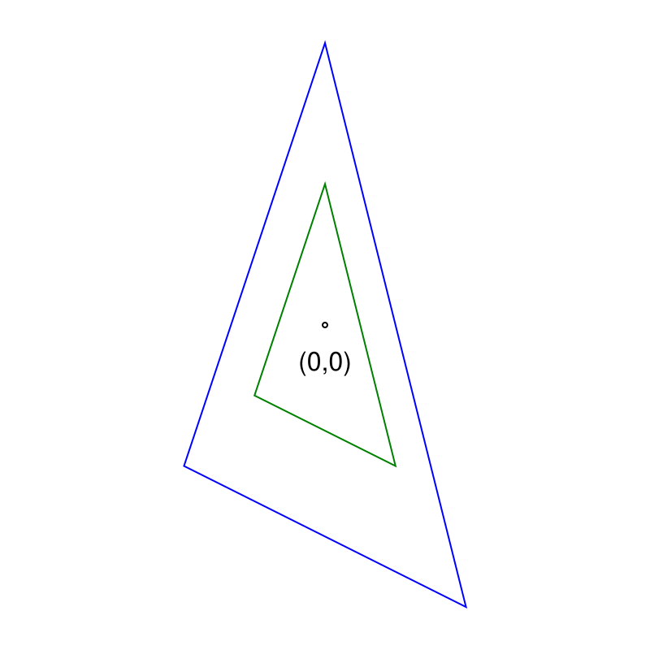</a>
</td>
<td width="50%" valign="top" align="center">
<a href="example_canvas.py"></a>
</td>
</tr>
<tr>
<td valign="top"><a href="example2.py"><code>example2.py</code></a> — Draws shapes on a <a href="../doc/canvas.md"><code>Canvas</code></a>, styling each with <code>stroke</code> and scaling a triangle by an integer factor. A style command applies to the shapes drawn after it.</td>
<td valign="top"><a href="example_canvas.py"><code>example_canvas.py</code></a> — Draws every bounded shape on one grid, and exports the same canvas as <a href="figures/canvas_gallery.svg">SVG</a>, <a href="figures/canvas_gallery.pdf">PDF</a> and <a href="figures/canvas_gallery.ipe">IPE</a>.</td>
</tr>

<tr>
<td width="50%" valign="top" align="center">
<a href="example_mindisk.py">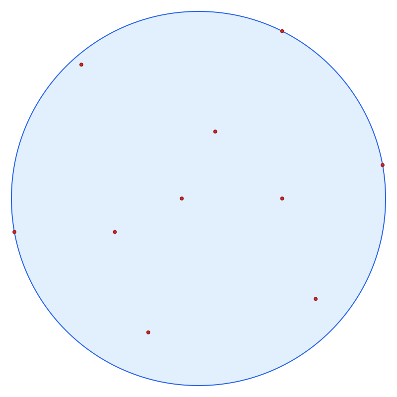</a>
</td>
<td width="50%" valign="top" align="center">
<a href="example_convex.py">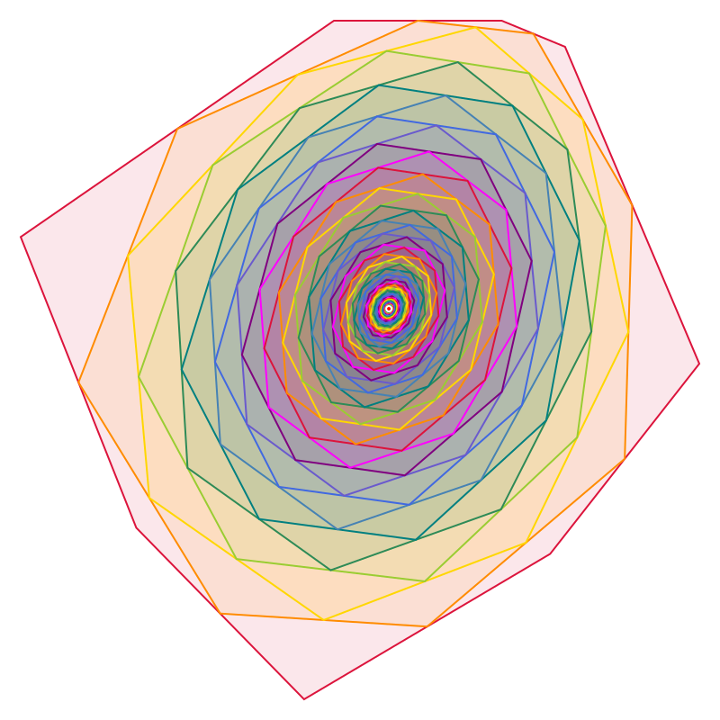</a>
</td>
</tr>
<tr>
<td valign="top"><a href="example_mindisk.py"><code>example_mindisk.py</code></a> — <a href="../doc/algorithms.md#smallest-enclosing-disk"><code>smallestEnclosingDisk</code></a> finds the smallest disk covering a point set, with an exact center and squared radius.</td>
<td valign="top"><a href="example_convex.py"><code>example_convex.py</code></a> — Iterates the midpoint map on a <a href="../doc/shapes.md#convex"><code>Convex</code></a> hull 100 times, every midpoint exact, converging to an affine-regular shape.</td>
</tr>

<tr>
<td width="50%" valign="top" align="center">
<a href="example_minkowskisum.py">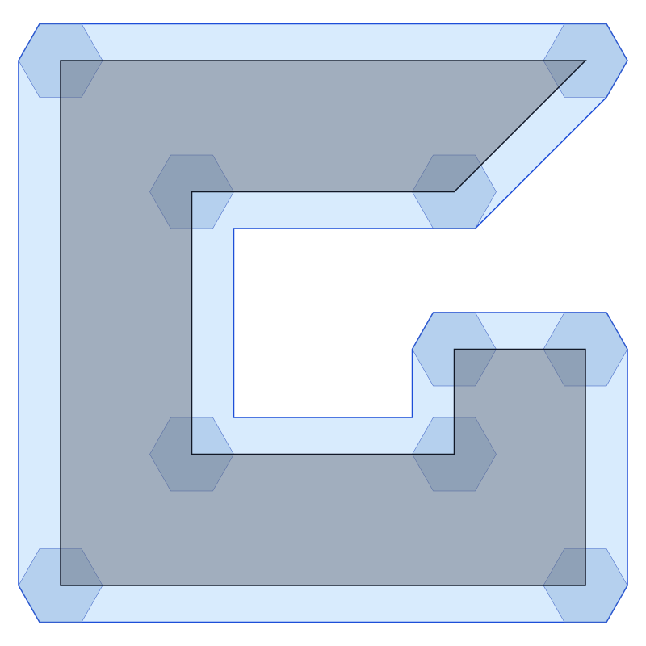</a>
</td>
<td width="50%" valign="top" align="center">
<a href="example_triangulation.py">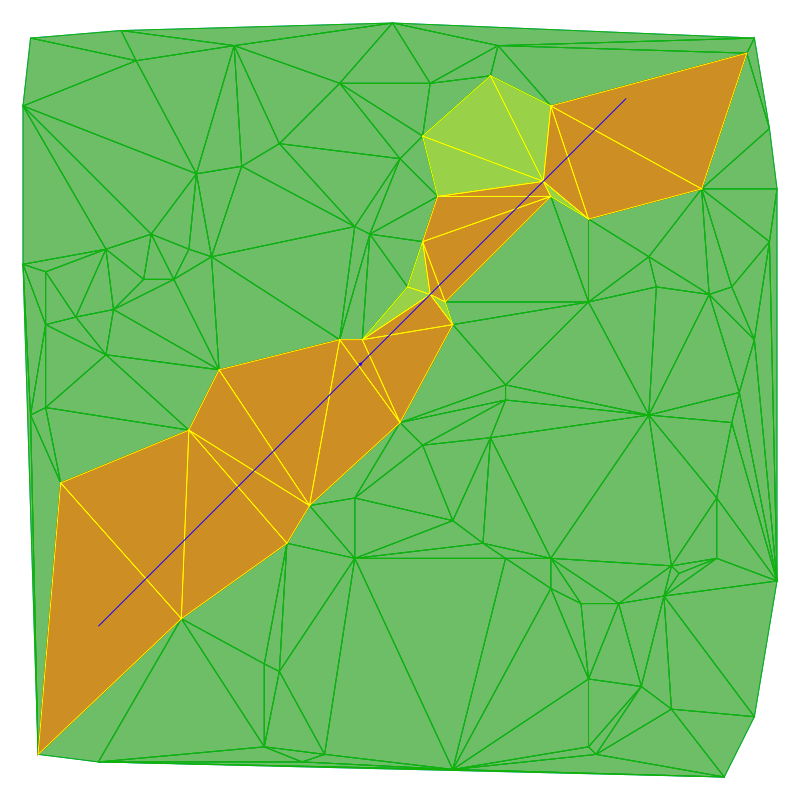</a>
</td>
</tr>
<tr>
<td valign="top"><a href="example_minkowskisum.py"><code>example_minkowskisum.py</code></a> — <code>minkowskiSum</code> grows a non-convex <a href="../doc/shapes.md#polygon"><code>Polygon</code></a> by a convex one, drawn over the union of one copy per vertex.</td>
<td valign="top"><a href="example_triangulation.py"><code>example_triangulation.py</code></a> — The Delaunay <a href="../doc/data_structures.md#triangulation"><code>Triangulation</code></a> of a point set, queried for the triangles a segment crosses and those it meets in the interior.</td>
</tr>

<tr>
<td width="50%" valign="top" align="center">
<a href="example_polygon_triangulation.py">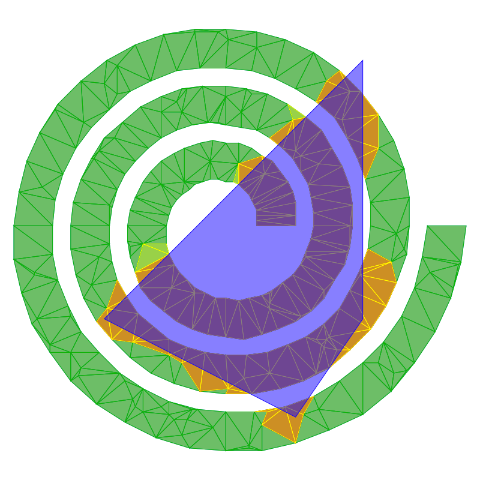</a>
</td>
<td width="50%" valign="top" align="center">
<a href="example_voronoi.py">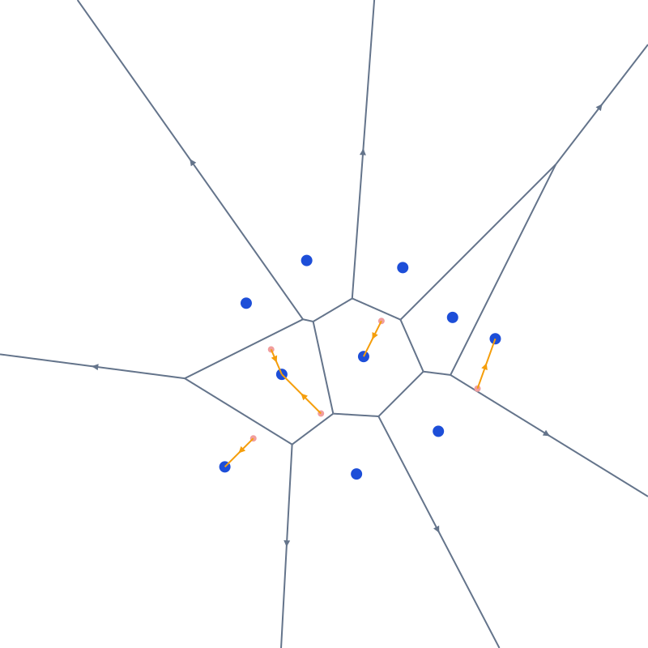</a>
</td>
</tr>
<tr>
<td valign="top"><a href="example_polygon_triangulation.py"><code>example_polygon_triangulation.py</code></a> — A constrained Delaunay triangulation of a spiral corridor with interior points, whose mesh never crosses a wall, with the same queries run against a convex window.</td>
<td valign="top"><a href="example_voronoi.py"><code>example_voronoi.py</code></a> — The Voronoi diagram as the dual <a href="../doc/data_structures.md#arrangement"><code>Arrangement</code></a> of a Delaunay triangulation, answering nearest-site queries by reading the site off a face label.</td>
</tr>

<tr>
<td width="50%" valign="top" align="center">
<a href="example_mst.py">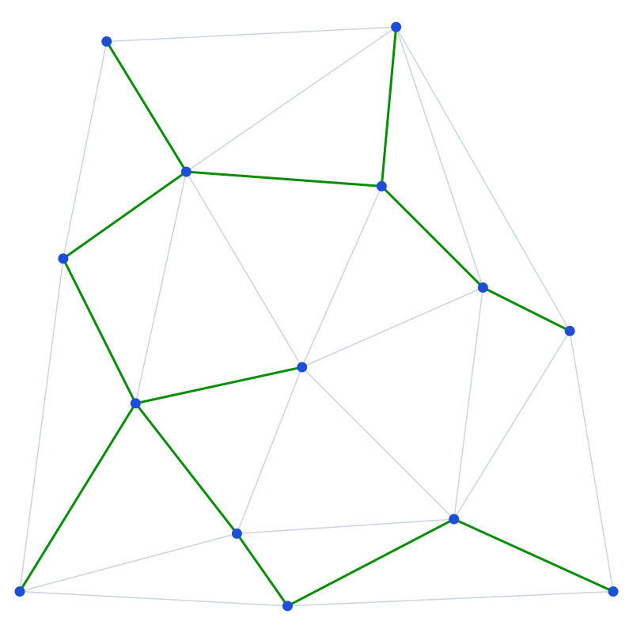</a>
</td>
<td width="50%" valign="top" align="center">
<a href="example_visibility.py">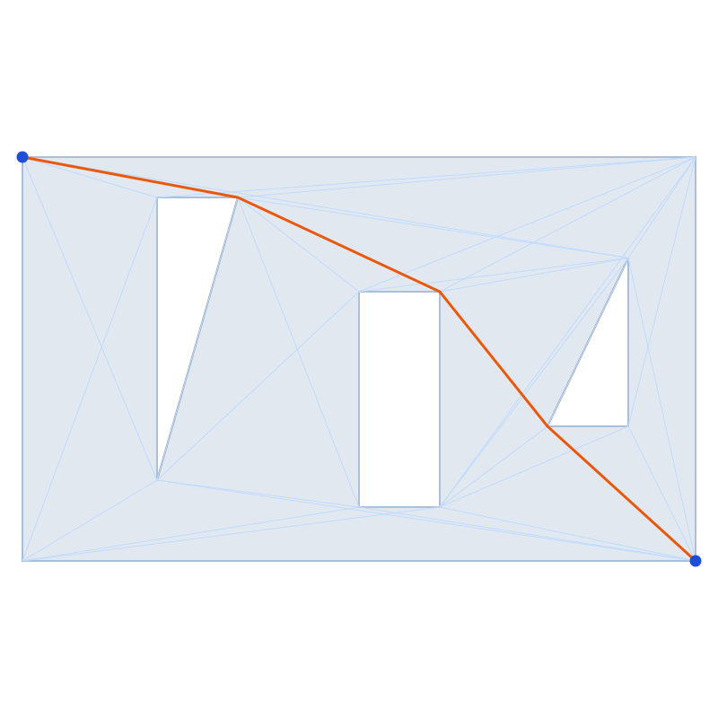</a>
</td>
</tr>
<tr>
<td valign="top"><a href="example_mst.py"><code>example_mst.py</code></a> — Hands a Delaunay triangulation over as a <a href="../doc/data_structures.md#graph"><code>Graph</code></a> and grows the Euclidean minimum spanning tree with <code>spanningTree</code>.</td>
<td valign="top"><a href="example_visibility.py"><code>example_visibility.py</code></a> — <a href="../doc/algorithms.md#visibility"><code>visibilityGraph</code></a> plus <code>shortestPath</code> give the shortest obstacle-avoiding path across a room with blocks.</td>
</tr>

<tr>
<td width="50%" valign="top" align="center">
<a href="example_arrangement.py">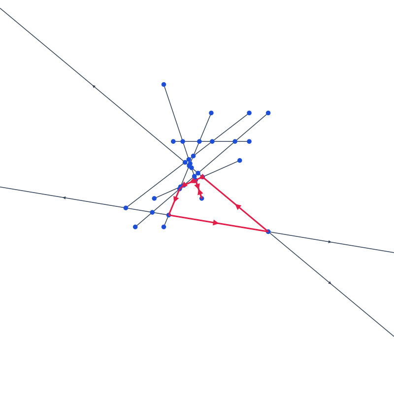</a>
</td>
<td width="50%" valign="top" align="center">
<a href="example_shapetree.py">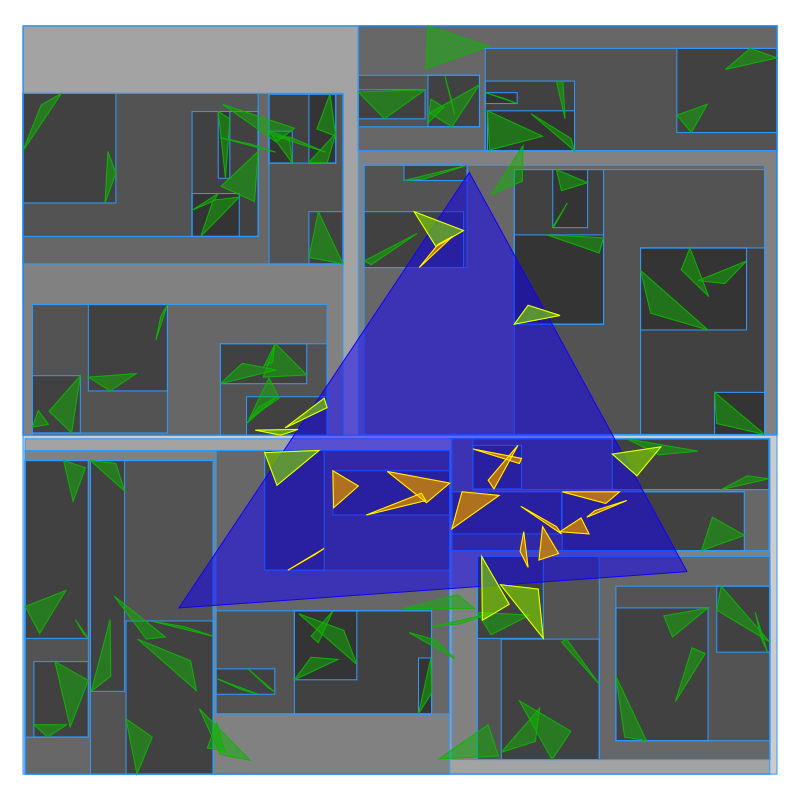</a>
</td>
</tr>
<tr>
<td valign="top"><a href="example_arrangement.py"><code>example_arrangement.py</code></a> — Builds the <a href="../doc/data_structures.md#arrangement"><code>Arrangement</code></a> of crossing segments and lines, whose crossings are exact rationals, and walks the boundary of its largest bounded face.</td>
<td valign="top"><a href="example_shapetree.py"><code>example_shapetree.py</code></a> — A <a href="../doc/data_structures.md#shape-tree"><code>ShapeTree</code></a> indexes random triangles, separating those contained in a query triangle from those merely intersecting it; it does the <a href="figures/example_shapetree_points.svg">same over points</a>. The tree's own node boxes are drawn underneath.</td>
</tr>
</table>

[`example1.py`](example1.py) has no figure: it prints, showing that two shapes
can meet (`intersects`) without their interiors meeting
(`interiorsIntersect`).

## Things worth knowing

**Styling chains.** Every canvas command returns the canvas:

```python
canvas.stroke("green").fill("red").fillOpacity("25%").draw(shape)
```

**`draw` takes a shape or a collection of them.** A whole construction can go
over at once — `canvas.draw(polygon.edges())`,
`canvas.draw(triangulation.triangles())`, `canvas.draw([tri, disk, point])` —
with every element drawn in order, in the style active at the call. The elements
may be of mixed types, and may be `None` (drawing nothing), so a result that may
come back empty needs no guard.

**Coordinates are exact, and `float` is rejected.** Coordinates are `int`,
`fractions.Fraction`, or `"a/b"` strings — never `float`, so the exactness
contract is never silently broken. Where an example computes a layout with
trigonometry ([`example_polygon_triangulation.py`](example_polygon_triangulation.py)),
it rounds to `int` before building the shape rather than letting an
approximation in.

**Every shape takes flat coordinates.** The fixed-size ones take them as
arguments (`Segment(0, 0, 8, 8)`, `Triangle(0, 0, 8, 0, 4, 8)`); `Convex`,
`Polygon`, `MonotoneChain` and `Polyline` take one flat list, read in `(x, y)`
pairs, so a literal shape needs no `Point` per vertex:

```python
pgl.Polygon([0, 0, 8, 0, 8, 8, 4, 4, 0, 8])
```

A sequence of `Point` works just as well, which is what a computed layout
usually has.

## In a notebook

Every shape and canvas has a `_repr_svg_`, so a bare expression renders inline in
Jupyter without any of the file-writing above:

```python
import pypgl as pgl
pgl.Convex([0, 0, 4, 0, 2, 3])   # draws itself
```
